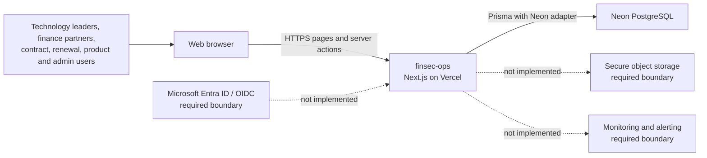
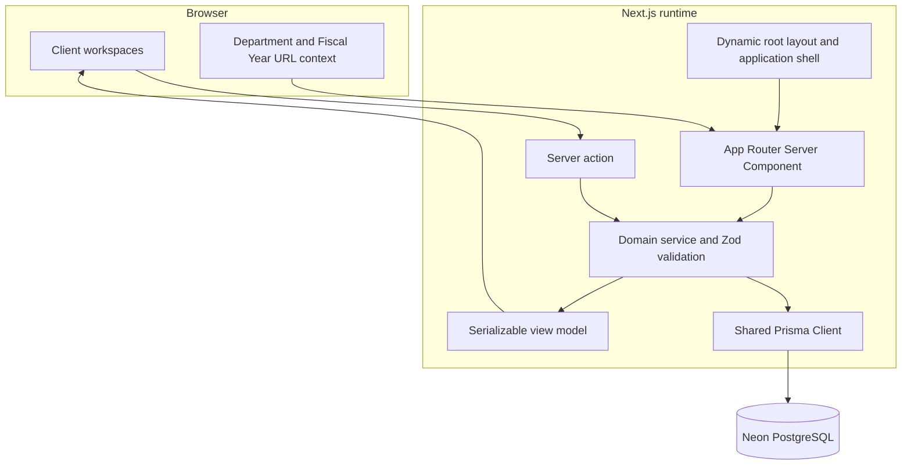
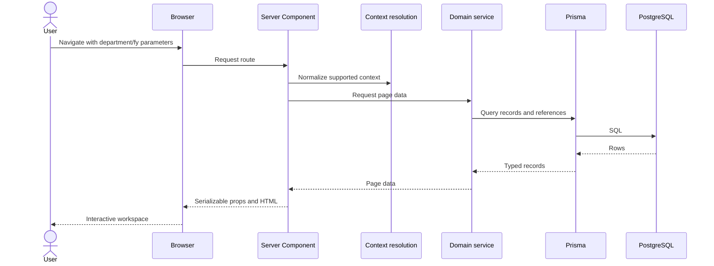
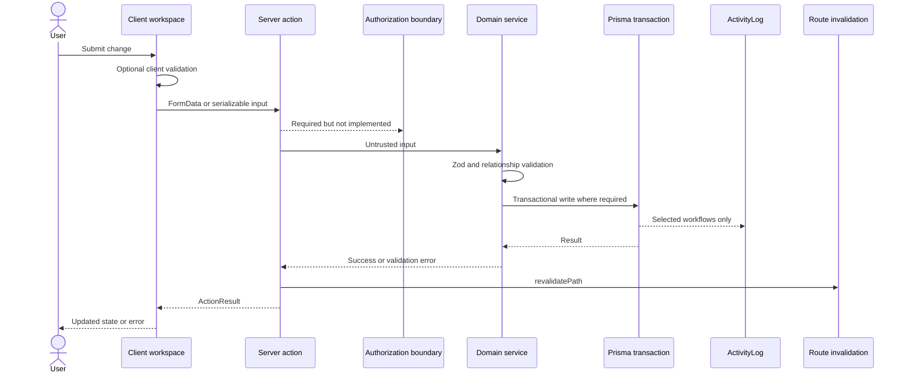

# System Architecture

## Purpose and goals

finsec-ops is a modular Technology Financial Operations application. Its
architecture prioritizes durable financial records, preservation of commercial
and operational history, explicit sources of truth, maintainable module
ownership, responsive data-heavy workspaces, and safe evolution toward
production controls.

The system is currently a modular Next.js application backed by one PostgreSQL
database. A distributed or microservice architecture is neither implemented nor
justified by present requirements.

Architectural goals are:

- accurate and traceable financial and commercial data;
- transactional multi-record mutations;
- historical preservation across contract terms, renewal cycles, and usage
  measurements;
- thin delivery layers and server-owned business rules;
- narrow browser data boundaries;
- Department and Fiscal Year reporting context;
- portable external-service boundaries;
- predictable deployment and migration procedures; and
- explicit security, observability, and scalability gates.

## System context

Vercel and Neon are the configured deployment targets. The repository contains
no implemented identity provider, file-object store, or production monitoring
integration. `Document` stores metadata and a location string only.

## Runtime architecture

The App Router root layout is `force-dynamic`. Pages parse search parameters,
call their owning service, and render Client Component workspaces. Database
workspaces show a setup state if a database URL is missing and a safe load-error
state if their initial read fails.

The application defines root route loading and safe error boundaries. Database
workspaces distinguish missing configuration from read failures without
exposing raw exception details to the browser. Reads execute at request time;
successful actions invalidate the affected data. Client workspaces hold
temporary editing, selection, filtering, sorting, drawer, and
column-preference state.

## Logical layers

| Layer                      | Responsibility                                                                         | Prohibited responsibility                           |
| -------------------------- | -------------------------------------------------------------------------------------- | --------------------------------------------------- |
| Route/page                 | Parse URL input, resolve context, call service, select workspace or setup state        | Business rules and direct mutation orchestration    |
| Application shell          | Navigation, page framing, shared selectors, workspace search                           | Module persistence and authorization policy         |
| Feature UI                 | Interaction state, client validation, rendering, action invocation                     | Direct Prisma access and authoritative calculations |
| Server action              | Adapt form/input, call service, return `ActionResult`, invalidate routes               | Trusting browser-provided identity or relationships |
| Domain service             | Zod validation, relationship checks, source-of-truth rules, transactions, DTO assembly | Browser-only state                                  |
| Pure domain utility        | Deterministic calculations, grouping, reusable rules                                   | Database or framework dependencies                  |
| Persistence                | Prisma schema, relations, constraints, migrations                                      | Presentation terminology and UI state               |
| External provider boundary | Future identity, storage, telemetry, or integration adapters                           | Domain ownership                                    |

Business logic belongs in domain services or pure domain utilities. React
components may calculate presentation-only values but must not become the only
enforcer of financial, relationship, lifecycle, or historical rules.

## Read path

Context-aware pages normalize `department` and `fy` through the shared
server-side resolver before calling a service. The same normalized selection
and active option set initialize the application shell. An omitted Fiscal Year
uses the configured active default; explicit `all` remains an all-years
selection. Several services still load broad relational graphs and filter in
application memory. This works for the current dataset but is not the
production query contract.

## Write path

There is currently no authentication or authorization check between the action
and service. Audit creation is implemented for document metadata, Department
reassignment, renewal register changes, and renewal comments, but is not a
universal mutation interceptor. The diagram labels both limitations.

## Module and source-of-truth boundaries

- `BudgetAnnualFinancial` is the fiscal-year financial amount record supporting
  worksheet and summary views. `BudgetItem` carries logical classification and
  Department ownership; worksheet-specific columns are stored on the annual
  record.
- `ContractLineItem` is the Contract product and pricing source of truth.
  Contract header totals are synchronized from lines by the service.
- `MaintenanceRenewalLineItem` is a snapshot and proposal boundary. Renewal
  work does not rewrite the current Contract.
- Approved renewal work creates a new Contract term linked through
  `previousContractId`; it preserves the earlier term.
- `Company` plus `CompanyRole` is the active vendor/reseller identity design.
  Legacy `Vendor` and `Reseller` foreign keys remain for compatibility.
- `Deployment` links to a Contract line, Maintenance Renewal line, or legacy
  purchase item. `UsageMeasurement` preserves measurements over time.
- `Document` owns metadata, links, and an external location reference, not file
  bytes.

See [Modules](modules.md), [Data model](data-model.md), and the
[ADR index](../architecture/decisions/README.md).

## Deployment architecture

Vercel builds and runs the Next.js application. `npm run build` executes Prisma
Client generation and `next build`; it does not apply migrations. Neon provides
PostgreSQL. Runtime access uses `DATABASE_URL`, falling back to
`POSTGRES_PRISMA_URL`. Prisma CLI operations prefer a direct/non-pooled URL when
available.

Environment databases and secrets must be isolated by deployment tier.
Migrations are a separately approved operation performed before compatible
application traffic depends on the change. See [Deployment](deployment.md) and
[Database and migrations](database-and-migrations.md).

## Trust and security boundaries

| Boundary           | Current condition                                       | Required condition                                                                         |
| ------------------ | ------------------------------------------------------- | ------------------------------------------------------------------------------------------ |
| Browser to server  | Zod validates many mutations; browser data is untrusted | Authenticated session, CSRF-aware action design, authorization on every operation          |
| Server to database | Server-only Prisma factory and parameterized ORM access | Least-privilege roles, isolated credentials, rotation, query and migration role separation |
| Department scope   | Reporting filter, not a permission boundary             | Server-enforced access scope independent of URL parameters                                 |
| Administration     | Settings and reassignment actions are unauthenticated   | Privileged roles, high-value audit events, confirmation and concurrency controls           |
| Documents          | Metadata and URL-like location are stored               | Authorized, encrypted, malware-scanned object storage with retention controls              |
| Financial data     | Stored and sent to unauthenticated browsers             | Data classification, field/record permissions, redacted errors and logs                    |
| Audit              | Explicit writes in selected services                    | Complete immutable event policy with actor identity and monitoring                         |

## Scalability and performance

Production query design must:

- filter, sort, aggregate, and paginate in PostgreSQL;
- avoid unbounded `findMany` operations;
- separate list DTOs from selected-record detail DTOs;
- select only fields required by the browser;
- index actual filter and join paths;
- cache stable reference data with explicit invalidation when justified;
- virtualize or page large data grids;
- maintain transactionally consistent writes;
- avoid serializing large Prisma graphs or Decimal/Date values implicitly; and
- preserve current interaction concepts while improving data access.

Current Catalog, Contract, Renewal, Deployment, Dashboard, and reference-data
reads include unbounded queries and broad `include` graphs. This is a documented
readiness gap, not an endorsed production pattern.

## Failure handling and observability

Current actions return field or general mutation errors. Database-backed pages
catch initial query errors and may expose the exception message in a setup
state. The application has no structured logger, correlation IDs, health
endpoint, query or route timing, error-monitoring provider, alert policy, or
operational dashboard.

Production requires:

- safe user errors paired with correlation identifiers;
- structured, redacted server logs;
- failed-mutation, route, dependency, and slow-query telemetry;
- liveness and dependency-aware readiness checks;
- release and migration markers;
- alert ownership and runbook links; and
- route-level error and loading boundaries.

These requirements are tracked in [Production readiness](production-readiness.md).

## Architectural change control

Changes to source-of-truth ownership, data history, trust boundaries, deployment
topology, cross-module workflows, or external providers require review against
this document and may require an ADR. Routine component and service changes do
not.
