# Data Model

Phase 1 defined the initial Prisma model for the core cybersecurity financial
operations domain. Phase 4.5 expands the budget model into a Finance-oriented
planning structure for fiscal-year budget plans, configurable account rollups,
annual financial records, operational maintenance renewal cycles, and savings
records.

## Model Scope

Implemented entities:

- Fiscal Year: planning period for budget plans, forecasts, renewals, purchase
  requests, invoices, and payments.
- Budget Plan: parent fiscal-year financial workspace with status, version,
  planning owner, assumptions, and executive narrative.
- Budget Scenario: version label such as Initial Request, Recommended,
  Submitted, or Final Approved without overwriting other versions.
- Budget Account: configurable Finance account code and name used by rollups.
- Organization Settings: single-organization application defaults such as
  organization name, short name, default currency, current fiscal year, fiscal
  year start month, and default timezone.
- Department: the organizational department that owns an item.
- Team Member: reference record for assignment and ownership, optionally tied
  to a Department. Team Members are not authentication accounts.
- Budget Item: continuing logical portfolio item such as OneTrust across years.
- Budget Annual Financial: fiscal-year and scenario-specific financial record
  for prior approved, current approved, proposed, approved, forecast, actual,
  savings, cost avoidance, and worksheet classification.
- Maintenance Renewal: operational renewal cycle record for review,
  disposition, quotes, approvals, workflow, replacement, decommissioning,
  purchasing links, funding, comments, and activity-style decision history.
- Maintenance Renewal Quote, Workflow Step, Task, Funding Allocation, Line
  Item, Decision History, Replacement Plan, Decommission Plan, and
  Decommission Task: child records that preserve the complete year-round
  renewal case.
- Savings Record: budget reduction or cost avoidance classification.
- Budget Category: fiscal-year-specific category for grouping cybersecurity
  spend.
- Budget Line Item: approved, forecasted, committed, and actual spend entry
  within a fiscal year and category.
- Vendor: company that makes or owns a cybersecurity product or service.
- Reseller: company the public-sector entity buys through.
- Contract: current commercial term that may reference both a vendor and a
  reseller.
- Contract Line Item: structured contract pricing and product scope row for a
  product, Product Component, quantity, license metric, unit price, annual
  amount, total amount, and renewable flag.
- Product: cybersecurity product or service owned by a vendor.
- Product Component: separately identifiable commercial item related to a
  product, such as an add-on, license tier, support package, service, capacity,
  retention tier, training, or hardware item.
- Capability: reusable cybersecurity outcome or service area such as SIEM,
  SOAR, XDR, DLP, MDR, or Security Awareness.
- Function: operational activity performed by a product or Product Component,
  optionally tied to a capability.
- Renewal: future contract or subscription renewal event.
- Purchase Request: procurement request for new spend, expansion, renewal, or
  true-up.
- Invoice: invoice tied to a fiscal year and optionally to contract, renewal,
  purchase request, vendor, or reseller.
- Payment: payment record tied to a fiscal year and optionally to invoice,
  contract, renewal, or purchase request.
- Document: external document reference attachable to vendors, resellers,
  contracts, renewals, purchase requests, invoices, products, and modules.
- Activity Log: audit-oriented record for create, update, delete, status,
  amount, and owner changes.
- User: lightweight user record for owners, uploaders, note authors, and audit
  actors. Authentication is not implemented.
- Note: human-authored context attachable to key financial operations entities.

## Relationship Rules

- Vendors and resellers are separate first-class entities.
- A vendor is the company that makes or owns the product.
- A reseller is the company the public-sector entity buys through.
- A contract may have both a vendor and a reseller.
- A product belongs to one vendor.
- A product can have many Product Components, but does not need components when
  the offering is sold as a single commercial item.
- A product and a Product Component can both have capabilities.
- A Function can belong directly to a product or to a Product Component and may
  reference one related capability.
- A contract can cover many products and many Product Components through
  `ContractLineItem` records. Contract header annual and total values are
  service-maintained reporting fields synchronized from line-item amounts.
- A renewal belongs to one contract and one fiscal year.
- Budget annual financial records belong to one logical budget item, one
  scenario, one budget plan, one fiscal year, and one configurable account.
- Supporting schedules feed Summary-tab account rollups automatically.
- Maintenance renewals can link to a budget annual financial record so planned,
  forecasted, approved, purchase order, actual, variance, funding, stage,
  disposition, decision, and risk summaries can feed Budget without moving the
  detailed operational workflow into Budget.
- A product or contract can have multiple maintenance renewal cycles over time.
  Contract-generated renewals copy renewable contract lines into
  `MaintenanceRenewalLineItem` snapshots so current contract pricing remains
  unchanged while proposed quantities, quote amounts, negotiated amounts, final
  amounts, and line actions are tracked for the next term.
- Completed renewals create a new Contract term linked to the prior term through
  `previousContractId` instead of overwriting contract history.
- Department is the organizational department that owns the item. This first
  Settings version intentionally uses one Department field per Budget item,
  Contract, Deployment, and Maintenance Renewal.
- Owner is the Team Member assigned responsibility for the item. This first
  Settings version intentionally uses one Owner field per Budget item,
  Contract, Deployment, and Maintenance Renewal.
- Department and Owner are separate references. Changing Owner must not
  automatically change Department.
- Budget line items may fund contracts, products, modules, renewals, or
  purchase requests through nullable relationships in the legacy Phase 1 model.
- Invoices and payments may tie back to contracts, renewals, or purchase
  requests.
- Documents use nullable relationships for the supported attachment targets.
- Activity logs use `entityType` and `entityId` for a portable audit trail
  instead of forcing a large set of audit-specific foreign keys.

## Enums

Implemented governed enums:

- `BudgetStatus`
- `ExpenseType`
- `FundingType`
- `ContractStatus`
- `RenewalStage`
- `RenewalStatus`
- `PurchaseRequestStatus`
- `InvoiceStatus`
- `PaymentStatus`
- `DocumentType`
- `ActivityAction`

Phase 2 through 4 added governed enum coverage for:

- Budget funding status values matching planned, requested, approved, partially
  approved, deferred, rejected, and unfunded states.
- Budget expense types that separate purchase type from security program area.
- Contract type, payment frequency, and renewal risk.
- Product category, capability category, deployment status, strategic value,
  criticality, and module adoption.

Phase 4.5 adds governed enum coverage for budget plan status, budget scenario
labels, worksheet type, budget funding status, row review state, recurring
classification, procurement status, seller relationship type, purchase status,
purchasing channel, license metric, savings type, maintenance renewal overall
status, workflow stage, stage status, task status, risk status, funding status,
quote status, renewal disposition, decision status, and renewal priority.

## Settings Reference Data

Settings uses concept-specific reference models instead of a generic dropdown
table. Configurable records include Fiscal Years, Departments, Team Members,
Budget Accounts, Budget Categories, Expense Types, Purchasing Vehicles, Payment
Frequencies, License Metrics, Deployment Environments, Renewal Priority labels,
and Renewal Decision Reasons.

Workflow values remain system-controlled when reporting, validation, or state
transitions depend on a known set of values. Contract status, Deployment status,
Maintenance Renewal workflow stage, renewal status, quote status, funding
status, approval status, payment status, and similar lifecycle states are not
administrator-configurable dropdowns.

## Phase 4.5 Budget Planning Model

Budget Plan is the parent financial workspace because Finance review happens at
the fiscal-year plan level, not at individual product or contract level.
Logical Budget Items preserve continuity across fiscal years, while Budget
Annual Financial records preserve year-specific approved, proposed, actual,
variance, savings, and cost avoidance values.

Budget Accounts are configurable records seeded with the initial government
Finance account codes. They are not hard-coded as the only valid accounts.
Supporting worksheets reference these accounts through worksheet defaults, while
row-level overrides remain available from the detail drawer when a Finance
exception is needed. The Summary tab calculates account rollups from the detail
rows instead of collecting duplicate totals.

The visible Phase 4.5 supporting worksheets are now category-specific entry
surfaces for software and SaaS, maintenance renewals, training, conferences,
travel, organizational dues, and professional services. Conference
registration and travel are split into separate worksheet types so account
mapping stays aligned with Finance expectations.

Maintenance Renewals are first-class operational records because renewal work is
not only a contract date or a budget row. A renewal can link to the annual
financial record that carries planned, forecasted, approved, purchase order,
actual, variance, funding, stage, disposition, decision, and risk summaries into
the upcoming fiscal-year budget. The detailed tasks, quotes, approvals,
decision history, comments, replacement plan, decommissioning plan, purchasing
links, and document links stay in the Maintenance Renewals module.

The operational model keeps separate fields for overall status, workflow stage,
recommended disposition, approved disposition, decision status, risk status,
funding status, and quote status. `RenewalDisposition` intentionally describes
what the organization plans to do with the product or service, while workflow
stage describes where the work currently sits. Recommended and approved
dispositions are preserved independently so an approver can choose a different
outcome without overwriting the recommendation.

Maintenance renewal records can link to existing Company vendor/reseller
records, Product Catalog products, Product Components, Functions, contracts,
purchasing vehicles, purchasing agreements, budget annual financial records,
budget items, legacy budget line items, capabilities, deployments, purchase
requests, purchases, invoices, payments, documents, and notes. Replacement and
decommissioning plans are stored as child records so Replace, Consolidate,
Decommission, and Do Not Renew decisions can drive operational follow-through
without duplicating catalog, purchasing, or contract records.

The intended commercial flow is:

```text
Contract
  -> Contract Line Items
  -> Maintenance Renewal
  -> Maintenance Renewal Line Items
  -> New Contract Term
```

Contracts are the source of truth for the current commercial term. Maintenance
Renewals manage the next-term operational process. Renewal lines are snapshots
and proposed changes, not direct edits to the current Contract. Completed
renewals create a new Contract term rather than overwriting history.

## Phase 2-4 Model Extensions

Budget line items now support optional vendor and reseller links, a product or
service label, budgeted amount, business justification, risk if not funded, and
notes text. `BudgetCategory` remains the fiscal-year-specific security program
or cost center grouping, while `ExpenseType` represents the purchase or spend
type.

Contracts now support contract type, associated product or service, renewal
date, auto-renewal, notice period, annual value, total value, payment
frequency, business/security/procurement ownership fields, vendor and reseller
account manager fields, renewal risk, renewal strategy, notes text, structured
line items, and linked term history.

The current transitional schema keeps legacy product cost, reseller,
deployment, and usage fields while adding the normalized replacement model.
New implementation should treat `Product` and Product Component records as
catalog records. Organization-specific seller, actual cost, term, deployment,
usage, owner, contract, and budget facts belong to purchases, purchase items,
deployments, usage measurements, and budget allocations. Catalog Product and
Product Component records may hold planning estimates only; authoritative
purchase cost comes from transactional records.

## Transitional Company And Purchase Model

`Company` is the normalized master-data record for vendors, resellers, service
providers, implementation partners, and consultants. A company can have
multiple `CompanyRole` rows. UI labels should still use Vendor when referring
to the company that owns, develops, publishes, provides, or sells a product or
service.

`Product` now has `offeringType` so software, SaaS, hardware, managed
services, professional services, training, support, and other offerings can be
distinguished. The current database keeps the existing `ProductModule` and
`ProductFeature` table names for migration safety, but the application and docs
present them as Product Components and Functions. Product Components add type,
SKU, license metric, purchasable/renewable flags, lifecycle, purpose, and
planning estimate fields. Functions can be product-level or component-level and
may reference one related capability. Because nullable `moduleId` uniqueness
cannot be represented safely by Prisma alone, the transitional migration SQL
adds PostgreSQL partial unique indexes for product-level and component-level
function names.

Capabilities are normalized through `Capability`, `ProductCapability`,
`ProductModuleCapability`, and `ProductFeatureCapability`. Redundancy analysis
should use these relationships instead of relying only on the old single
capability-category field. Capability links now support primary flags, notes,
allocation guidance, and allocation method metadata so future spend reporting
can allocate purchase-line cost without counting the same line multiple times.

Resellers are reusable Company master-data records with the `RESELLER` role.
Budget, renewal, contract, and purchase workflows should select reseller-role
companies directly when a spend row uses a buying channel such as SHI,
Presidio, Carahsoft, or CDW-G. `ProductSeller`, `PurchasingVehicle`,
`PurchasingVehicleSeller`, and `PurchasingVehicleProductEligibility` remain
available for transactional purchase/agreement constraints, but they are no
longer exposed in the Product Catalog and must not create manual
reseller-to-product catalog mappings.

`PurchaseRequest` remains the pre-commit request workflow. `Purchase` is only
for approved, ordered, committed, received, completed, or canceled
acquisitions. `PurchaseItem` records hold purchased products/components,
selected functions, quantity, cost, and term. `PurchaseBudgetAllocation` allows one
purchase to split across multiple budget items or annual financial records.
Header totals are derived from line-item totals; the stored purchase
`totalAmount` is a denormalized service-maintained value for reporting.

`Deployment` can reference a Contract Line Item and may keep a nullable legacy
Purchase Item link during the transition. Separate scopes, environments,
departments, or waves can be tracked independently. `UsageMeasurement` stores
usage history instead of overwriting deployment with only the latest usage
value. Deployment Owner now uses the shared Team Member reference, while legacy
owner text is preserved as a snapshot for migration safety. Usage measurements
track licensed count, deployed count, active usage count, utilization
percentage, source, notes, and measurement date so history is append-only.

## Entity Relationship Overview

```mermaid
erDiagram
  Company ||--o{ CompanyRole : has
  Company ||--o{ Product : owns
  Company ||--o{ ProductSeller : sells
  Company ||--o{ Purchase : selected_seller
  Product ||--o{ ProductComponent : contains
  Product ||--o{ ProductFunction : has
  ProductComponent ||--o{ ProductFunction : optionally_contains
  Product ||--o{ ProductCapability : maps
  ProductComponent ||--o{ ProductComponentCapability : maps
  ProductFunction ||--o{ ProductFunctionCapability : maps
  Capability ||--o{ ProductCapability : classifies
  Capability ||--o{ ProductComponentCapability : classifies
  Capability ||--o{ ProductFunctionCapability : classifies
  PurchasingVehicle ||--o{ PurchasingVehicleSeller : awards
  PurchasingVehicleSeller ||--o{ PurchasingVehicleProductEligibility : scopes
  PurchaseRequest ||--o{ Purchase : may_result_in
  Contract ||--o{ Purchase : supports
  PurchasingVehicle ||--o{ Purchase : used_by
  Contract ||--o{ ContractLineItem : prices
  ContractLineItem ||--o{ MaintenanceRenewalLineItem : snapshots
  Purchase ||--o{ PurchaseItem : contains
  PurchaseItem ||--o{ PurchaseItemFeature : includes
  ProductFunction ||--o{ PurchaseItemFunction : selected
  Purchase ||--o{ PurchaseBudgetAllocation : allocates
  PurchaseItem ||--o{ PurchaseBudgetAllocation : optionally_allocates
  BudgetItem ||--o{ PurchaseBudgetAllocation : funds
  BudgetAnnualFinancial ||--o{ PurchaseBudgetAllocation : funds
  BudgetAnnualFinancial ||--o{ MaintenanceRenewal : summarizes
  MaintenanceRenewal ||--o{ MaintenanceRenewalQuote : preserves
  MaintenanceRenewal ||--o{ MaintenanceRenewalWorkflowStep : tracks
  MaintenanceRenewal ||--o{ MaintenanceRenewalTask : owns
  MaintenanceRenewal ||--o{ MaintenanceRenewalFundingAllocation : funds
  MaintenanceRenewal ||--o{ MaintenanceRenewalLineItem : compares
  MaintenanceRenewal ||--o{ MaintenanceRenewalDecisionHistory : records
  MaintenanceRenewal ||--o| MaintenanceRenewalReplacementPlan : may_require
  MaintenanceRenewal ||--o| MaintenanceRenewalDecommissionPlan : may_require
  PurchaseItem ||--o{ Deployment : deploys
  Deployment ||--o{ UsageMeasurement : measures
  Purchase ||--o{ Invoice : billed_by
  Invoice ||--o{ Payment : paid_by
```



## Monetary Fields

Money fields use Prisma `Decimal` with PostgreSQL `Decimal(14, 2)` precision
and a `currencyCode` string defaulting to `USD`. TypeScript sample data and
calculation helpers use integer cents. The initial schema does not implement
multi-currency conversion.

## Attachments And Notes

Documents and notes are modeled as first-class records with nullable foreign
keys to supported entities. This keeps Phase 1 simple and queryable without
adding a generic attachment framework or document upload workflow.

## Deferred Questions

- Tenant or organization boundaries are deferred until authentication and
  authorization design.
- Detailed accounting concepts such as GL accounts, cost centers, journal
  entries, and payment reconciliation are out of scope.
- Reviewed migrations still need to be applied against the target
  Vercel-managed Neon development database before live persisted use.
