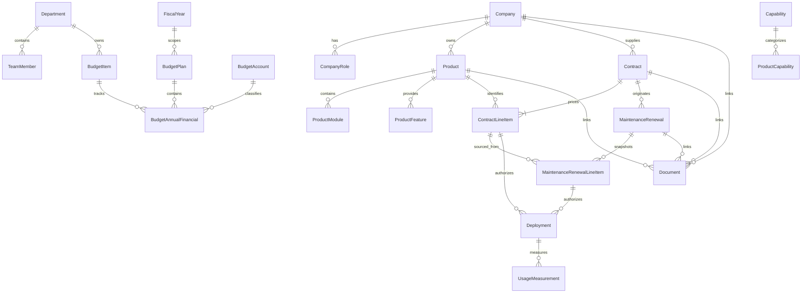

# Data Model

`prisma/schema.prisma` is the schema source of truth. This document explains
domain ownership, relationships, history, and transition boundaries rather than
repeating fields. Monetary values use PostgreSQL `Decimal(14,2)` unless noted;
percentages use `Decimal(5,2)`.

## Core relationship view

```mermaid
erDiagram
    Department ||--o{ TeamMember : contains
    FiscalYear ||--o{ BudgetPlan : scopes
    BudgetPlan ||--o{ BudgetAnnualFinancial : contains
    BudgetItem ||--o{ BudgetAnnualFinancial : tracks
    BudgetAccount ||--o{ BudgetAnnualFinancial : classifies
    Department ||--o{ BudgetItem : owns

    Company ||--o{ CompanyRole : has
    Company ||--o{ Product : owns
    Product ||--o{ ProductModule : contains
    Product ||--o{ ProductFeature : provides
    Capability ||--o{ ProductCapability : categorizes

    Company ||--o{ Contract : supplies
    Contract ||--|{ ContractLineItem : prices
    Product ||--o{ ContractLineItem : identifies
    Contract ||--o{ MaintenanceRenewal : originates
    MaintenanceRenewal ||--o{ MaintenanceRenewalLineItem : snapshots
    ContractLineItem ||--o{ MaintenanceRenewalLineItem : sourced_from

    ContractLineItem ||--o{ Deployment : authorizes
    MaintenanceRenewalLineItem ||--o{ Deployment : authorizes
    Deployment ||--o{ UsageMeasurement : measures

    Contract ||--o{ Document : links
    MaintenanceRenewal ||--o{ Document : links
    Company ||--o{ Document : links
    Product ||--o{ Document : links
```

## Organization, Department, and ownership

`OrganizationSettings` is a singleton-by-convention record for organization
name, branding, currency, locale, timezone, and preferred current Fiscal Year.
The schema does not enforce singleton cardinality.

`Department` is the principal reporting and ownership scope for Budget items,
Contracts, Deployments, Maintenance Renewals, Team Members, and Budget accounts.
Names are unique. Records can be inactive; referenced history is preserved with
nullable relations and legacy text fields where the transition is incomplete.

`TeamMember` is configurable ownership reference data with unique email and an
optional Department. It is used by current Budget, Contract, Deployment, and
Maintenance Renewal workflows. `User` remains the actor and legacy ownership
model used by notes, audit events, older renewal/procurement records, savings,
and deployment role references, and now also owns the application identity
mapping. `entraTenantId` plus `entraSubject` is the unique immutable Entra
identity; email is not an identity key. `active` defaults to false.

`UserDepartmentAccess` grants a User access to a Department through a composite
user/Department key. The application role matrix separately determines whether
the user may read or modify a module and whether explicit Department grants can
be bypassed for approved cross-Department roles. `TeamMember` is not an
authentication record and is not automatically linked by matching email.

## Fiscal Year and reference data

`FiscalYear` defines label, start/end dates, lifecycle state, active/current
flags, and relationships to financial and operational records. Labels are
unique. A committed partial database index permits only one `isCurrent = true`
row, while `OrganizationSettings.currentFiscalYearId` is the application
preference.

Configurable reference tables include:

- `BudgetCategory`, scoped to Fiscal Year;
- `BudgetAccount`, optionally scoped to Department;
- `ExpenseTypeOption`;
- `PaymentFrequencyOption`;
- `LicenseMetricOption`;
- `DeploymentEnvironment`;
- `RenewalPriorityOption`;
- `RenewalDecisionReason`; and
- `PurchasingVehicle`.

Reference rows carry active and ordering fields. Deactivation is preferred to
deletion when history refers to a value. Prisma enums remain authoritative for
system lifecycle states; option tables control labels, ordering, and which
values are selectable.

`BudgetAccount` is unique by `(departmentId, code)`, with a migration-defined
partial unique index for global rows whose `departmentId` is null. Prisma cannot
express the latter index completely, so migration SQL is part of the integrity
contract.

## Budget and annual financial records

`BudgetPlan` represents a version within a Fiscal Year and is unique by
`(fiscalYearId, version)`. It owns annual financial records, scenarios,
Maintenance Renewals, and savings records. `BudgetScenario` remains in the
model, although the active workspace does not expose scenario planning or
roll-forward workflow.

`BudgetItem` is the logical, potentially multi-year classified item. It carries
worksheet type, Department and owner references, vendor/seller, Contract,
Product, Product Component, funding state, and descriptive classifications.
Legacy vendor/reseller and text owner fields remain beside Company and
TeamMember relations.

`BudgetAnnualFinancial` is the year-specific amount and supporting-schedule
record. It links a Budget Item, Plan, Fiscal Year, account, required scenario,
and optional Maintenance Renewal. It stores prior, requested, proposed, approved,
forecast, encumbered, actual, unit, recurring, savings, and avoidance amounts,
plus worksheet-specific fields for Software, training, conference, travel,
services, memberships, and dues.

The important integrity rules are:

- Contract-to-Budget handoff treats the first matching logical item and
  Plan/scenario annual row as its update target, but the database does not
  enforce one annual row per logical item and Plan;
- a Plan and annual row must refer to the same Fiscal Year;
- summary values derive from supporting annual rows;
- relationship and worksheet-detail consistency is service-validated, not
  fully represented by database checks; and
- deletion of an annual record must not silently erase history in other years.

`BudgetLineItem` is an earlier financial/procurement compatibility model with
Fiscal Year, category, Department, vendor/seller, Contract, Renewal,
Maintenance Renewal, Purchase Request, and amount fields. It is not the active
Budget worksheet source of truth.

`SavingsRecord` distinguishes budget reduction from cost avoidance and links to
a Budget Plan, optional Annual Financial and Maintenance Renewal records, and a
legacy `User` owner.

## Companies, vendors, and resellers

`Company` is the active organization identity. `CompanyRole` gives a Company
one or more unique roles, including vendor and reseller. Products belong to a
vendor Company; seller relationships and purchasing vehicles link reseller or
other permitted Company roles.

Legacy `Vendor` and `Reseller` tables still exist, and many historical models
retain both legacy foreign keys and newer Company foreign keys. The transition
is therefore incomplete. Current Catalog and most active workflows prefer:

- vendor: `vendorCompanyId` referencing a Company with `VENDOR` role;
- reseller/seller: `sellerCompanyId` referencing an eligible Company role; and
- historical display: preserve legacy or inactive relations rather than
  coercing them to the first active option.

Migration work must compare every dual foreign key, define canonical ownership,
backfill idempotently, validate parity, switch all reads and writes, and only
then consider removal of legacy columns or tables. No current documentation
authorizes that removal.

## Product Catalog

`Product` is a vendor-owned offering. It holds commercial and portfolio
classification, lifecycle, cost, ownership text, legacy Contract/Budget links,
and relations to Components, Functions, sellers, Capabilities, pricing lines,
purchases, deployments through those lines, and supporting records.

`ProductModule` is the database name for a **Product Component**. It can be
separately purchasable or renewable and carries component type, lifecycle, SKU,
license metric, planning estimate, quantities, adoption, ownership, and
Capability allocations.

`ProductFeature` is the database name for an operational **Function**. A
Function belongs to a Product and may optionally belong to a Product Component.
It can have a primary Capability and additional Capability joins. Partial unique
indexes distinguish product-level Functions from component-level Functions
when the component foreign key is nullable.

`Capability` is reusable taxonomy. `ProductCapability`,
`ProductModuleCapability`, and `ProductFeatureCapability` are allocation joins.
Capabilities are not pricing records.

`ProductSeller` relates a Product to a seller Company with relationship type,
preference, dates, seller identifiers, and notes. It supports commercial
eligibility but is not a primary visible Catalog view.

## Contracts and pricing

`Contract` is the commercial header: parties, identifiers, type and status,
dates, renewal controls, owners, Department, payment terms, and synchronized
annual/total values. It may link to a previous Contract, allowing a new term to
preserve the old term.

`ContractLineItem` is the pricing and product-scope source of truth. It stores
Product and optional Product Component, description, quantity, license metric,
unit price, annual amount, total amount, effective dates, renewability, and
ordering. It owns related Deployments and can be the source for Renewal line
snapshots.

The service validates vendor/Product/Component relationships and synchronizes
header totals. Database constraints preserve parent/child and deletion
behavior, but monetary derivation and compatibility are service invariants.
Contracts with dependent operational or financial records are terminated rather
than hard-deleted.

## Maintenance Renewals

`MaintenanceRenewal` is the active operational renewal case. It owns distinct
overall status, workflow stage, recommendation and approved disposition,
decision/risk/funding/quote states, dates, financial values, owner references,
Department/Fiscal Year/Plan/account links, vendor/seller, Product and component,
commercial sources, replacement/decommission planning, and next-cycle lineage.

Supporting records are:

- `MaintenanceRenewalLineItem` — current Contract snapshot and proposed/final
  Product or Component terms;
- `MaintenanceRenewalQuote` — vendor quote history and selected-final marker;
- `MaintenanceRenewalWorkflowStep` and `MaintenanceRenewalTask` — operational
  work tracking;
- `MaintenanceRenewalFundingAllocation` — linked or textual funding;
- `MaintenanceRenewalDecisionHistory` — recommendation/approval changes;
- `MaintenanceRenewalReplacementPlan`;
- `MaintenanceRenewalDecommissionPlan` and its checklist tasks;
- `Deployment`, `Note`, `ActivityLog`, Purchase Request, Invoice, Payment, and
  compatibility purchase links.

Renewal line records deliberately snapshot Contract values. Later Contract or
Catalog edits must not rewrite the decision evidence. A new cycle or Contract
term is a new linked record.

`Renewal` is a separate earlier compatibility model linked to Contract, Fiscal
Year, Products, Product Components, procurement records, documents, and notes.
It is not the active Maintenance Renewals register and must not be conflated
with it during migrations.

## Purchases and procurement compatibility

`Purchase` and `PurchaseItem` model executed commercial acquisition, separate
from `PurchaseRequest`. A Purchase identifies seller, Fiscal Year, status,
channel, Contract, Maintenance Renewal, purchasing vehicle/agreement, and total.
Items identify Product, optional Product Component, selected Functions,
quantities, costs, allocations, and Deployments.

`PurchaseBudgetAllocation` splits Purchase or item amounts across a Fiscal Year
and optional Budget Item or Annual Financial record.
`PurchasingVehicle`, `PurchasingVehicleSeller`, and
`PurchasingVehicleProductEligibility` model seller and product eligibility.

`PurchaseRequest`, `Invoice`, and `Payment` preserve lifecycle and compatibility
relationships across Contracts, renewals, companies, and Fiscal Years. The
active application does not provide an end-to-end procurement, invoicing, or
payment workflow. These models are transition and integration boundaries, not
evidence of supported accounting capabilities.

## Deployment and utilization

`Deployment` represents a scoped implementation or use. It can reference a
Contract line, Maintenance Renewal header or line, or Purchase Item. It also
stores Product, Department, Team Member owner, legacy owner/Department text,
environment, status, progress, utilization, populations, dates, blockers, and
outcomes.

`UsageMeasurement` is append-only time-series history by design. It captures
licensed, deployed, and active-use counts, utilization, source, notes, and
measurement time. The latest measurement may inform the Deployment summary
without deleting earlier evidence.

Some source foreign keys are optional to support transition. Services must
enforce that a new Deployment has a valid authoritative source and compatible
Product; the database does not encode every allowed-source combination.

## Documents, notes, and activity

`Document` stores title, governed type, validated external URL, optional
description, timestamp, and polymorphic foreign keys to Company, Contract,
Maintenance Renewal, Product, purchase/procurement, legacy vendor/reseller, and
other entities. The repository implements no binary object storage.

`Note` is textual commentary with similar optional entity links. Maintenance
Renewal comments are stored as Notes and also create an activity event.

`ActivityLog` is a generic event record keyed by `entityType` and `entityId`,
with action, actor, field/value changes, amount changes, metadata, and timestamp.
Those entity keys are not foreign keys. Audit creation is currently explicit in
selected services, so database presence does not imply complete coverage or
immutability.

## Integrity and history principles

- Preserve prior Contract terms, Renewal line snapshots, annual financial
  years, inactive reference values, usage measurements, documents, notes, and
  audit events.
- Prefer deactivation or terminal lifecycle state when a referenced record has
  historical significance.
- Use a transaction when totals, child rows, lineage, audit, or reference flags
  must change together.
- Validate nullable polymorphic and transitional relationships in services.
- Treat Decimal-to-browser serialization and rounding as an explicit boundary.
- Add database constraints for invariants PostgreSQL can enforce; document
  partial indexes that Prisma cannot express.

## Migration boundary

The committed migration history starts with a large Company/purchase transition
against a pre-existing schema. It does not contain a conventional initial
migration that deterministically creates the complete current schema from an
empty database. Later migrations add Catalog taxonomy, operational Renewals,
Contract lines, Settings, worksheet details and backfill, Department-scoped
accounts, and Renewal-scoped Deployments.

Before production promotion, the team must establish and test a reviewed
baseline strategy. See [Database and migrations](database-and-migrations.md).
