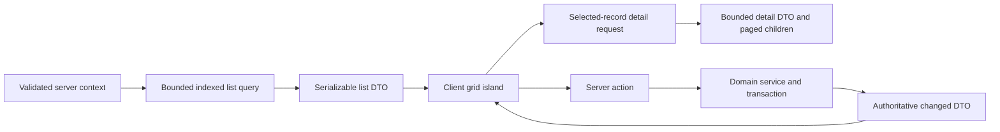

# Performance and Production Hardening Plan

## Status and authority

This document is the authoritative performance audit and execution plan for
finsec-ops. It records the repository evidence reviewed on 2026-07-29 and
defines the performance gates that phased implementation must satisfy.

This is a planning artifact. It does not authorize a broad visual redesign, a
new persistence source, a microservice split, schema changes without reviewed
migrations, or activation of compatibility purchase workflows. The existing
Next.js, service, Prisma, PostgreSQL, and module ownership boundaries remain the
target architecture.

The Production Readiness document owns the overall launch decision. This
document owns performance findings, targets, sequencing, and performance
acceptance evidence.

## Executive conclusion

The application is not ready for production-scale data.

The dominant risk is query and payload shape, not isolated slow JavaScript or a
single missing index. The primary pages read unbounded tables and broad
relational graphs, filter and aggregate after transfer, serialize large object
graphs into monolithic Client Components, render all matching rows, and repeat
the same work after narrow mutations. Adding indexes, TanStack Query, or
TanStack Table before defining bounded server query contracts would preserve
the underlying failure mode.

The highest-risk paths are:

1. Maintenance Renewals: 18 blocking top-level reads and an almost complete
   detail graph for every renewal.
2. Contracts: an unbounded list that embeds line items, renewal lines,
   documents, and term relationships for every contract.
3. Product Catalog: 11 tab-insensitive reads, including three result sets the
   active workspace does not consume.
4. Budget: every annual, renewal, and savings row is loaded before Department
   and Fiscal Year filtering, then the full worksheet is recalculated and
   rendered in the browser.
5. Dashboard, Deployment, Documents, and Settings: broad or unused reads,
   application-memory aggregation, and no bounded list contracts.

A correctness issue amplifies the cost: direct route loads can query all Fiscal
Years while the client shell later displays the configured default Fiscal Year.
Server-owned context normalization is therefore the first implementation
prerequisite.

## Audit method and evidence limits

The audit covered:

- all active App Router pages and server actions;
- the shared layout, context provider, navigation, search, and UI primitives;
- all feature workspaces and their current import boundaries;
- all server services and Prisma call sites;
- the complete Prisma schema and committed migration history;
- unit, component, service, and Playwright coverage;
- package, Next.js, TypeScript, Vitest, and Playwright configuration;
- compatibility purchase code that remains in the repository; and
- the existing production-readiness, architecture, module, data, database,
  testing, deployment, and operations documentation and relevant ADRs.

A clean `npm run build` completed during the audit. All active routes were
reported as dynamic and server-rendered on demand. Emitted client-JavaScript
chunks were measured from the clean production build. Gzip values are the sum
of individually compressed emitted chunks and are a comparison baseline, not a
substitute for browser transfer telemetry.

The baseline used repository revision `cbf4824`, Node `v24.14.0`, npm `11.9.0`,
and the locked Next.js `16.2.10`. Run `npm run build`, read each route's
`entryJSFiles` from
`.next/server/app/**/page_client-reference-manifest.js`, de-duplicate the listed
chunks for that route, and record emitted bytes plus per-chunk gzip bytes. Phase
0 must commit a reusable measurement script and baseline artifact so future
results do not depend on an ad hoc shell command.

| Route         | Emitted initial JS, raw | Emitted initial JS, gzip | Source boundary indicator                                   |
| ------------- | ----------------------: | -----------------------: | ----------------------------------------------------------- |
| `/`           |                780.2 KB |                 231.2 KB | 275-line client Dashboard plus statically imported Recharts |
| `/budgets`    |                470.6 KB |                 141.5 KB | 3,108-line, 92,812-byte Budget Client Component             |
| `/contracts`  |                482.2 KB |                 144.1 KB | 3,033-line, 102,677-byte Contracts Client Component         |
| `/renewals`   |                470.3 KB |                 143.1 KB | 766-line, 62,228-byte Maintenance Renewals Client Component |
| `/products`   |                452.9 KB |                 137.0 KB | 1,740-line, 51,543-byte Product Catalog Client Component    |
| `/deployment` |                439.6 KB |                 133.9 KB | 1,031-line, 34,331-byte Deployment Client Component         |
| `/documents`  |                427.8 KB |                 131.2 KB | 428-line, 13,577-byte Documents Client Component            |
| `/settings`   |                441.1 KB |                 134.0 KB | 1,200-line, 34,863-byte Settings Client Component           |

No live database was queried. The configured database is not documented as
disposable, and the repository has no safe production-scale fixture harness.
Consequently:

- actual row counts, data distributions, cache-hit ratios, and connection
  pressure are unknown;
- candidate indexes are based on verified query shapes, not live
  `EXPLAIN (ANALYZE, BUFFERS)` results;
- route latency and RSC/data payload baselines remain to be measured; and
- no claim in this document certifies production performance.

## Current request and data flow

The audited modules remain separate implementation workstreams. Their handoffs
are integration boundaries, not a reason for one list page to embed another
module's detail graph.

```mermaid
flowchart LR
    subgraph Budget["Budget"]
        BPage["/budgets Server Component"] --> BService["Budget workspace read"]
        BService --> BDB["6 unbounded Prisma reads"]
        BDB --> BFilter["Node scope, map, and duplicate worksheet DTOs"]
        BFilter --> BClient["Budget Client Component and full worksheet"]
    end

    subgraph Contracts["Contracts"]
        CPage["/contracts Server Component"] --> CService["Contract page read"]
        CService --> CDB["10 Prisma reads and all Contract detail graphs"]
        CDB --> CFilter["Node scope filtering"]
        CFilter --> CClient["Contracts Client Component and all rows"]
    end

    subgraph Renewals["Maintenance Renewals"]
        RPage["/renewals Server Component"] --> RService["Renewal page read"]
        RService --> RDB["18 Prisma reads and nearly complete case graphs"]
        RDB --> RFilter["Node scope filtering"]
        RFilter --> RClient["Renewals Client Component and all rows"]
    end

    subgraph Catalog["Product Catalog"]
        PPage["/products Server Component"] --> PService["Tab-insensitive Catalog read"]
        PService --> PDB["11 unbounded Prisma reads"]
        PDB --> PClient["Catalog Client Component and browser joins"]
    end
```

The target flow for each data-heavy workspace is:

## Cross-application findings

Severity means:

- **P0:** blocks production-scale qualification or can make the displayed data
  scope differ from the queried scope;
- **P1:** material latency, payload, browser, or operating-cost risk that must
  be resolved before production authorization; and
- **P2:** secondary optimization or evidence gap to resolve after bounded
  contracts exist.

| ID     | Severity | Finding                                                                                                                                                                                           | Evidence                                                                                                                                                                            | Required outcome                                                                                                                                                                                 |
| ------ | -------- | ------------------------------------------------------------------------------------------------------------------------------------------------------------------------------------------------- | ----------------------------------------------------------------------------------------------------------------------------------------------------------------------------------- | ------------------------------------------------------------------------------------------------------------------------------------------------------------------------------------------------ |
| SYS-01 | P0       | Server queries do not consistently apply the shell's default Fiscal Year. The client provider begins at `all/all` and changes after hydration.                                                    | `src/components/app/global-context-provider.tsx:28`; route parsing in Dashboard, Budget, Contracts, Maintenance Renewals, Deployment, and Documents pages                           | Resolve, validate, and share one server-owned Department/Fiscal Year selection before service reads. Add omitted, invalid, explicit `all`, and inactive-context tests.                           |
| SYS-02 | P0       | Production list reads are not bounded by a common contract.                                                                                                                                       | Unbounded `findMany` calls throughout `src/lib/server` and the documented gap in `docs/architecture.md`                                                                             | Default page size 50, hard maximum 100, stable order plus cursor, explicit list DTO, and separate detail query for every growing record set.                                                     |
| SYS-03 | P0       | The repository has no production-scale dataset, query budget, load test, or route/payload performance gate.                                                                                       | `docs/testing.md:77` and existing test suites                                                                                                                                       | Establish deterministic scale fixtures, timing/query instrumentation, browser traces, plan capture, and CI regression thresholds before certification.                                           |
| SYS-04 | P1       | Root layout and all active pages are dynamic; stable Departments, Fiscal Years, settings, and option data are repeatedly fetched.                                                                 | `src/app/layout.tsx:25`; `src/lib/server/global-context.ts:28`; overlapping service reads                                                                                           | Request-memoize shared reads and apply short tagged server caching only to stable reference DTOs, with explicit Settings/Catalog invalidation and authorization-aware keys when identity exists. |
| SYS-05 | P1       | Full-document navigation repeats shell and page work. Sidebar and search use anchors; context selectors use `window.location.assign`.                                                             | `src/components/app/app-navigation-sidebar.tsx:69`, `src/components/app/global-context-provider.tsx:99`, `src/components/app/header-search.tsx:20`                                  | Use App Router navigation after reads are bounded. Disable speculative prefetch initially where it would multiply expensive dynamic reads.                                                       |
| SYS-06 | P1       | Server actions broadly invalidate routes, and clients often call `router.refresh()` or `window.location.reload()` as well.                                                                        | Budget actions `src/app/budgets/actions.ts:18`; Contract actions `src/app/contracts/actions.ts:36`; Renewal reload `src/components/renewals/maintenance-renewals-workspace.tsx:756` | A successful mutation has one user-visible refresh round trip while every affected row, detail, metric, aggregate, dependency key, and server tag is updated or invalidated.                     |
| SYS-07 | P1       | Raw Prisma graphs are passed through `JSON.parse(JSON.stringify(data))` on most database pages.                                                                                                   | Contract, Renewal, Product, Deployment, Documents, and Settings pages                                                                                                               | Map explicit Date/Decimal-safe DTOs with only fields required by the list, detail, or editor. Remove double traversal.                                                                           |
| SYS-08 | P1       | Large feature modules make entire pages Client Components; unopened editors, detail panels, and histories ship and hydrate initially.                                                             | Production build and source-boundary table above                                                                                                                                    | Preserve client grids. Server-render static detail only when selection is URL/server-owned; otherwise lazy-load a narrow client detail/editor island.                                            |
| SYS-09 | P1       | The shared layout Suspense boundary does not expose a useful loading shell because context is awaited before the provider subtree can render. No critical route has `loading.tsx` or `error.tsx`. | `src/app/layout.tsx:39`; route inventory                                                                                                                                            | Add route-level loading/error boundaries and stream independent summary/list/detail regions after query contracts are split.                                                                     |
| SYS-10 | P2       | `src/components/ui/table.tsx` is marked `"use client"` although it renders only intrinsic elements.                                                                                               | `src/components/ui/table.tsx:1`                                                                                                                                                     | Make the primitive server-compatible so server-rendered tables do not inherit an unnecessary client boundary.                                                                                    |
| SYS-11 | P1       | Bulk Department reassignment updates records one at a time inside a transaction.                                                                                                                  | `src/lib/server/department-reassignment-service.ts:84`                                                                                                                              | Preserve per-record warnings and audit data, but use bounded batches, set-based updates where valid, and bulk audit writes.                                                                      |
| SYS-12 | P2       | Compatibility purchase loaders and actions remain unbounded/chatty even though `/purchases` redirects to Contracts.                                                                               | `src/app/purchases/page.tsx:3`; `getPurchasePageData` in `src/lib/server/catalog-service.ts:1079`                                                                                   | Keep the route inactive. Require a separate performance review and bounded contracts before any purchase UI is reactivated.                                                                      |

## Budget audit

### Original verified path

`/budgets` reads reseller options before starting `getBudgetWorkspaceData`.
The service then performs six parallel top-level reads for Fiscal Years,
Accounts, Plans, Annual Financials, Maintenance Renewals, and Savings Records.
Annuals, Renewals, and Savings are read without query scope or bounds.
Department and Fiscal Year predicates are applied in Node, after materializing
the complete result sets. The service creates Annual rows, Budget Items, six
worksheet-specific detail arrays, Renewals, Savings, Plans, Accounts, and Fiscal
Years, all of which enter one Client Component.

Evidence:

- sequential reseller/workspace read: `src/app/budgets/page.tsx:15`;
- six-read loader and broad includes: `src/lib/server/budget-service.ts:135`;
- in-memory scope: `src/lib/server/budget-service.ts:187`;
- duplicated worksheet DTO construction: `src/lib/server/budget-service.ts:203`;
- all-row worksheet render: `src/components/budgets/budget-workspace.tsx:1426`;
- mutation refresh: `src/components/budgets/budget-workspace.tsx:317`; and
- all-annual key forcing remount semantics: `src/app/budgets/page.tsx:36`.

### Phase 3 implementation outcome

`getBudgetWorkspaceData` now resolves the current Plan/scenario and validated
context before annual reads. Summary mode returns SQL aggregate baselines
without materializing annual rows. Entry worksheets push Department, Fiscal
Year, Plan, worksheet, search, stable sort, and pagination into PostgreSQL,
with 50 rows by default and a hard maximum of 100. Only renewals linked to the
visible annual page are read. Fiscal Years, Plans, and Accounts use narrow,
bounded reference DTOs.

The route parses worksheet/search/sort/page controls before loading data, and
the explicit all-Fiscal-Years view is distinct from omitted or invalid context.
The client renders the server page and combines the authoritative totals,
period comparisons, savings, and account-rollup baseline with local draft
deltas. Worksheet URL changes therefore request only the selected worksheet
instead of preloading every schedule. The persisted Budget-to-Maintenance
handoff remains transactional, idempotent, audited, and locally reconciled.

### Original significant findings

| ID     | Severity | Finding                                                                                                                                                                                                       | Required outcome                                                                                                                                                                  |
| ------ | -------- | ------------------------------------------------------------------------------------------------------------------------------------------------------------------------------------------------------------- | --------------------------------------------------------------------------------------------------------------------------------------------------------------------------------- |
| BUD-01 | P0       | Every Annual, Renewal, and Savings row is fetched before context filtering. The Annual query includes Account, Budget Item, legacy and current parties, Department, and Fiscal Year.                          | Resolve current Plan/scenario and context first. Query only the active worksheet page and explicitly required prior-period rows. Use SQL summaries/rollups.                       |
| BUD-02 | P0       | An omitted URL context loads all history while the client may display the default FY; the workspace also contains an FY2027 preference.                                                                       | Apply SYS-01 and remove client-owned default selection. Treat all-years as an explicit bounded report, not absence of a parameter.                                                |
| BUD-03 | P0       | Every matching worksheet row renders, and keystrokes trigger whole-array maps, filters, sorts, totals, and account-by-annual scans. Row lookup is linear per rendered row.                                    | Normalize row maps, memoize derived values and row components, then page or virtualize the entry grid. Enforce a DOM row bound.                                                   |
| BUD-04 | P1       | Every mutation refetches and can remount the complete workspace; broad invalidation also marks Contracts and Renewals stale.                                                                                  | Return changed-row DTOs, reconcile affected summary/account aggregate keys in the same update cycle, use mutation-specific invalidation, and remove the concatenated all-row key. |
| BUD-05 | P1       | The reseller read is a real request waterfall; shared Fiscal Years and reference options are repeatedly queried.                                                                                              | Parallelize independent page reads and then consolidate/cached reference DTOs with explicit invalidation.                                                                         |
| BUD-06 | P1       | List, worksheet detail, and mutation shapes are wide. Six client state arrays duplicate Annual/Item facts; a one-field edit submits and rewrites most fields.                                                 | Define summary, worksheet-row, row-detail, and patch mutation DTOs. Re-read and validate authoritative state on the server.                                                       |
| BUD-07 | P1       | Worksheet URL changes trigger RSC navigation although every worksheet is already resident in the browser.                                                                                                     | Either make worksheet switching local without a server refetch, or make the URL meaningful by loading only that worksheet.                                                        |
| BUD-08 | P1       | Create serializes Plan lookup, default-account selection, row count, and transaction work; duplicate serializes source lookup, row count, and transaction work. Contract handoff has additional serial reads. | Replace `count`-as-order allocation with a safe ordering strategy, parallelize independent validations, and use bounded transactions.                                             |
| BUD-09 | P1       | The 3,108-line Client Component eagerly includes summaries, grid, detail, confirmation, transfer, and reassignment surfaces.                                                                                  | Keep the editable grid client-side; split/lazy-load rare panels and allow static shells/summaries to render server-side where instant local recalculation is not required.        |
| BUD-10 | P2       | “Send to Maintenance” currently updates only local state and does not persist a Renewal.                                                                                                                      | Treat this as a functional gap. Do not performance-tune it as a real cross-module write until product behavior is implemented and reviewed.                                       |

### Budget query and index plan

Existing indexes support primary joins but not the target worksheet page:
`BudgetAnnualFinancial(budgetPlanId, scenarioId)`, separate Fiscal Year,
Budget Item, Account, and Worksheet indexes, `BudgetItem(departmentId)`, and
`SavingsRecord(budgetPlanId)`.

Validate these candidates only after the bounded query is implemented:

- `BudgetAnnualFinancial(budgetPlanId, scenarioId, worksheet, sortOrder, id)`
  for the worksheet cursor;
- `SavingsRecord(budgetPlanId, createdAt DESC, id)` for Plan-scoped history;
- `BudgetItem(contractId, active)` for Contract handoff lookup;
- `MaintenanceRenewal(fiscalYearId, departmentId, renewalDate, createdAt, id)`
  only if Renewals remain a separate Budget-side list; and
- a unique `(budgetPlanId, scenarioId, budgetItemId)` only if the business
  invariant is approved and existing duplicates are reconciled first.

The bounded implementation uses the Plan, worksheet, Department, Fiscal Year,
and stable-order access paths above. A read-only `EXPLAIN (FORMAT JSON)` review
was completed against the configured database after the query shapes stabilized.
That dataset is not production-shaped: it contains seven Annual Financial rows,
six Contracts, five Maintenance Renewals, 83 Companies, 112 Products, one Note,
and 24 Activity Log rows. PostgreSQL correctly prefers sequential scans and
small in-memory sorts at those cardinalities, so the review does not justify an
index migration. The candidate composite indexes remain intentionally pending
until a representative scale fixture or production-safe statistics prove lower
read cost than their write and storage overhead.

### Budget TanStack decision

- **TanStack Table:** controlled pilot for the entry worksheet grid only. Use
  manual server pagination/sorting, stable row IDs, and existing custom edit
  cells. Table does not virtualize; add virtualization only if measured
  continuous-scroll requirements justify it. Do not use it for small summary
  or rollup tables.
- **Implementation:** the entry worksheet now uses a controlled Table row
  model with stable Annual IDs and manual filter, sort, and pagination state.
  Existing URL controls and the server worksheet query remain authoritative;
  custom editable cells and current-page draft totals are unchanged.
- **TanStack Query:** adopt only after `budgetSummary`,
  `budgetWorksheetPage`, `budgetRowDetail`, and reference contracts exist. Key
  by Department, FY, Plan/scenario, worksheet, sort/filter, and cursor. Seed
  initial server data, prefetch adjacent pages/tabs, and reconcile row,
  summary, and account-rollup keys after mutations.
- Preserve instant unsaved worksheet totals with an authoritative server
  aggregate baseline plus the selected row's local draft delta. Pagination
  must not silently change current draft-total behavior.
- Stable reference data remains server-cached; do not put a Query provider at
  the application root solely for Budget.

## Contracts audit

### Original verified path

Before the bounded Contract work, `/contracts` called `getContractPageData`,
which performed 10 parallel Prisma reads. The Contract read had no predicate
or limit and included Department,
parties, owner, prior and next terms, every pricing line and Product/Component,
every linked Maintenance Renewal and its lines, and Documents for every
Contract. All Budget annuals and reference collections are also loaded.
Department and Fiscal Year filtering happens afterward. The result is
double-serialized into a 3,033-line Client Component, locally searched, sorted,
summarized, and rendered.

Evidence:

- page and serialization: `src/app/contracts/page.tsx:8`;
- list-plus-detail read: `src/lib/server/contract-service.ts:317`;
- in-memory context scope: `src/lib/server/contract-service.ts:396`;
- local filtering/metrics: `src/components/portfolio/contracts-management.tsx:518`;
- all-row render: `src/components/portfolio/contracts-management.tsx:1051`;
- broad invalidation: `src/app/contracts/actions.ts:36`; and
- client refreshes: `src/components/portfolio/contracts-management.tsx:723`.

The active write path is Client editor or inline form →
`saveContractWithLinesAction` → server validation → atomic Contract and line
reconciliation → route invalidation. Contract-to-Budget,
Contract-to-Maintenance-Renewal, and Renewal-to-new-Contract-term operations
are separate explicit handoffs.

### Implemented bounded read contract

`listContracts` now applies Department and Fiscal Year scope, approved search
semantics, vendor/reseller/status/renewal-window filters, stable sort, cursor,
and page size in PostgreSQL. The default page is 50 rows and the hard maximum is 100. Its explicit row DTO contains the Contract header fields required by the
register, a line count, and one latest-Renewal summary. It never embeds Contract
lines, Renewal lines, or Documents.

The selected row is fetched by scoped ID through `getContractDetail`. Pricing
lines are capped at 100; Renewal and Document summaries are capped at 20 each.
Register metrics use PostgreSQL `count` and `sum` operations over the resolved
scope rather than reducing the browser page. Search, filters, sorting, selected
row, and next cursor are URL-owned, so the Client Component renders only the
returned bounded page.

Initial list visits no longer fetch Products, Product Components, Fiscal Years,
Budget Plans, Budget Accounts, or Budget annuals. The editor reads at most 100
Products for the selected vendor and Components only for selected Products.
Budget/Renewal handoff options are read on dialog open, scoped where applicable,
and capped at 100 per collection. The page passes explicit Date/Decimal-safe
DTOs and no longer double-serializes a Prisma graph.

Focused service tests assert the list maximum, SQL scope/filter/order shape,
absence of Contract lines, Renewal lines, and Documents from register rows, and
selected-detail child bounds. A production-shaped PostgreSQL dataset,
`EXPLAIN (ANALYZE, BUFFERS)`, payload measurements, and browser evidence remain
required before performance certification or index migration.

### Significant findings

| ID     | Severity | Finding                                                                                                                                                                   | Required outcome                                                                                                                      |
| ------ | -------- | ------------------------------------------------------------------------------------------------------------------------------------------------------------------------- | ------------------------------------------------------------------------------------------------------------------------------------- |
| CON-01 | P0       | The default list embeds nearly every detail relationship for every Contract. Some loaded relationships, including term navigation, are not represented in the client DTO. | Create a narrow paged list and a selected Contract detail query. Never embed Renewal lines or Documents in the Contract list.         |
| CON-02 | P0       | Department/FY filtering happens after loading all Contracts and all Budget annuals with five relations.                                                                   | Push scope and date predicates into PostgreSQL. Fetch Budget handoff data only when its dialog opens.                                 |
| CON-03 | P0       | Search, filter, sort, metrics, and rendering scan the entire browser array; the fixed-height scroll region is not virtualization.                                         | Use server filter/sort/page contracts and bounded DOM rendering.                                                                      |
| CON-04 | P1       | Products, Components, FYs, Plans, Accounts, and Annuals are loaded on normal list visits even when the editor or handoff UI is never opened.                              | Lazy-load editor and handoff options; query Products by selected vendor and Components by selected Product.                           |
| CON-05 | P1       | Ten parallel reads form one monolithic barrier; the page cannot stream useful content until every graph completes.                                                        | Split list, selected detail, editor options, handoff options, and metrics behind independent boundaries.                              |
| CON-06 | P1       | Mutations combine broad three-route invalidation with explicit client refreshes.                                                                                          | Use one current-list patch/refresh and invalidate Renewals or Budget only for an actual handoff.                                      |
| CON-07 | P1       | Composite saves validate each pricing line and write each reconciliation operation sequentially over a remote database connection.                                        | Batch/narrow validation reads, validate relationship sets, and reduce per-line transaction round trips without weakening atomic save. |
| CON-08 | P2       | Reorder performs one update per line and recomputes totals even though ordering cannot change money.                                                                      | Use an efficient bounded reorder and do not resynchronize totals for a pure order change.                                             |
| CON-09 | P1       | Raw Prisma graphs are double-serialized and the monolithic client ships all editors, detail panels, Documents, Renewal history, and handoff dialogs.                      | Use explicit DTOs and lazy client islands; selected-record URL state may later permit server-rendered static detail.                  |
| CON-10 | P2       | Contract read-path tests do not cover page data, query counts, pagination, payload, plans, or scale.                                                                      | Add real-PostgreSQL query-contract and production-build browser coverage.                                                             |

### Contracts query and index plan

Current schema indexes are primarily single-column foreign-key indexes plus
`Contract(startsOn, endsOn)`. They do not match scoped default ordering by
`endsOn, title` or a renewal-date branch.

Validate:

- `Contract(departmentId, endsOn, title, id)` for scoped default lists;
- `Contract(endsOn, title, id)` for organization-wide lists;
- `Contract(departmentId, renewalDate, id)` for a separate renewal-window
  branch; avoid one broad overlap-or-renewal `OR` when two indexed queries can
  be combined safely;
- `MaintenanceRenewal(contractId, renewalDate DESC, createdAt DESC, id)` for
  selected Contract history;
- `MaintenanceRenewal(contractId, fiscalYearId, overallStatus)` for
  duplicate-renewal checks; and
- retention of `ContractLineItem(contractId, sortOrder)`.

The implemented default query is
`WHERE departmentId = ? [AND (term overlap OR renewalDate in FY)] ORDER BY
endsOn, title, id LIMIT 51`; alternate sorts retain `title, id` tie breakers.
Renewal-window filters use separate `renewalDate` and
`renewalDate IS NULL AND endsOn` branches. Selected history queries use
`WHERE contractId = ? ORDER BY renewalDate DESC, createdAt DESC LIMIT 20`.
No index was added in this phase because the repository has no verified
production-shaped database or plan capture.

Date-overlap planning must be proved on production-shaped data. A range index
or query rewrite is a later evidence-based decision, not a default migration.

### Contracts TanStack decision

- **TanStack Table:** recommended for the Contract grid in manual
  pagination/sorting/filtering mode, preserving custom inline cells and
  selection.
- **TanStack Query:** recommended after list, detail, editor-option, and
  handoff-option endpoints exist. Use context/filter/cursor list keys and
  per-Contract detail keys. Prefetch selected detail and patch or narrowly
  invalidate after mutations.
- Query invalidation and `revalidatePath` must not become competing owners of
  the same client data.

## Maintenance Renewals audit

### Original verified path

Before the bounded-register work, `/renewals` called an 18-read `Promise.all`.
It loaded Companies, Products with
Capabilities, Components, Functions, Capabilities, FYs, Plans, Accounts, all
Budget annuals, legacy Budget lines, Contracts, purchasing records, Purchases,
Purchase Requests, Team Members, 1,000 global Renewal Activity Logs, and all
Renewals. Each Renewal includes most of its budget, commercial, product,
purchase, deployment, quote, workflow, task, funding, decision, replacement,
decommission, invoice/payment, note, and product-line graph. The current
register does not consume several complete top-level result sets.

Evidence:

- 18-read fan-out: `src/lib/server/maintenance-renewal-service.ts:192`;
- near-complete relation graph: `src/lib/server/maintenance-renewal-service.ts:289`;
- in-memory scope: `src/lib/server/maintenance-renewal-service.ts:358`;
- actual smaller client data contract:
  `src/components/renewals/maintenance-renewals-workspace.tsx:146`;
- client filtering: `src/components/renewals/maintenance-renewals-workspace.tsx:413`;
- all-row register: `src/components/renewals/maintenance-renewals-workspace.tsx:557`; and
- product-line full reload:
  `src/components/renewals/maintenance-renewals-workspace.tsx:756`.

The active register write path is register edit →
`updateRenewalRegisterAction` → server validation → Renewal and Activity Log
transaction → route invalidation. Comment and Product-line actions are
separate active paths. Legacy case-management service operations that the
current workspace does not invoke are not part of the initial register
mutation contract.

### Implemented bounded read contract

The Maintenance Renewals route now resolves list controls from URL parameters
and applies context, search, optional filters, deterministic sort, and
pagination in the Prisma query. The list defaults to 50 rows and caps requested
page sizes at 100 rows. Its explicit row DTO contains only register columns and
a latest-comment preview assembled from one set-based Note query for the page's
renewal IDs.

Selected detail is fetched by scoped ID through a separate query. Comments and
Activity/decision History are bounded to 50 records each, Product lines to 100,
and deployment summaries to bounded child results. Activity is queried by
`(entityType, entityId)`; the global 1,000-row preload and unused case-management
page datasets are removed. The register preserves URL Department/Fiscal Year
context, supports the existing `renewal` deep link, and adds URL-backed
search/filter/sort/page controls without changing the selected-record workspace
or transactional mutation boundaries.

Product, Product Component, Fiscal Year, Budget Plan, and Budget Account editor
options are not part of the initial register read. A safe read-only server
action loads the bounded editor option DTO only when create/edit or selected
Product-line management opens. Initial Company, Team Member, and co-op reads
are the role-aware active filter facets rendered by the register.

Focused service tests assert the 100-row maximum, database scope, set-based
comment preview, and selected-detail/history bounds. Production-scale query
plans remain required before adding the candidate compound indexes below.

### Significant findings

| ID     | Severity | Finding                                                                                                                                                                                                                                                       | Required outcome                                                                                                                                       |
| ------ | -------- | ------------------------------------------------------------------------------------------------------------------------------------------------------------------------------------------------------------------------------------------------------------- | ------------------------------------------------------------------------------------------------------------------------------------------------------ |
| REN-01 | P0       | The page reads a legacy case-management universe that the current operational register does not consume. Entire Functions, Capabilities, Budget annual/line, Contract, agreement, Purchase, and Purchase Request result sets are unused by the active client. | Delete unused page reads. Reintroduce a dependency only through a bounded explicit workflow.                                                           |
| REN-02 | P0       | Every Renewal carries nearly its complete detail and child history graph.                                                                                                                                                                                     | Use a narrow paged register row. Fetch selected overview, product lines, Comments, History, and optional legacy subwork independently and with bounds. |
| REN-03 | P0       | Context, search, six filters, and rendering all operate over every Renewal in memory.                                                                                                                                                                         | Push scope/filter/sort/page to PostgreSQL and bound rendered rows.                                                                                     |
| REN-04 | P1       | The latest 1,000 Activity Logs across all Renewals are fetched, then filtered by selected ID. Unrelated activity can evict valid history.                                                                                                                     | Query selected-record history by `(entityType, entityId)` with cursor pagination.                                                                      |
| REN-05 | P1       | Eighteen parallel reads still form one blocking initial barrier.                                                                                                                                                                                              | Stream list and selected detail independently; lazy-load comments/history and inactive subwork.                                                        |
| REN-06 | P1       | Product-line save/delete performs a full browser reload after route invalidation.                                                                                                                                                                             | Return the changed line/summary DTO and patch selected detail without losing scroll, selection, or column state.                                       |
| REN-07 | P1       | Register update performs current-record, party, Product, owner, and Department validations sequentially.                                                                                                                                                      | Use narrow selects and parallel/set validation inside the authoritative service boundary.                                                              |
| REN-08 | P1       | Stable reference data is refetched on every visit and every broad refresh.                                                                                                                                                                                    | Cache role-aware reference DTOs with explicit Settings/Catalog invalidation.                                                                           |
| REN-09 | P1       | The client eagerly includes preferences, create/edit, detail, Comments, History, and product editing.                                                                                                                                                         | Keep the register controller client-side and lazy-load selected and edit surfaces.                                                                     |
| REN-10 | P2       | Tests cover selected validation and column order, not the read path, page bounds, payload, or refresh behavior.                                                                                                                                               | Add query-contract, selected-detail, browser, and scale tests.                                                                                         |

### Maintenance Renewals query and index plan

The schema contains many isolated status/date indexes and the useful
`MaintenanceRenewalLineItem(maintenanceRenewalId, sortOrder)` index. It lacks
the compound scope/order and child-history indexes required by the target
queries.

Validate:

- `MaintenanceRenewal(fiscalYearId, departmentId, renewalDate, createdAt, id)`
  for scoped lists;
- `MaintenanceRenewal(fiscalYearId, renewalDate, createdAt, id)` for
  all-Department lists;
- `MaintenanceRenewal(departmentId, renewalDate, createdAt, id)` for an
  explicit all-Fiscal-Year Department list, unless that selection is defined
  as a separately bounded reporting query;
- `ActivityLog(entityType, entityId, occurredAt DESC, id)` for selected
  history;
- `Note(maintenanceRenewalId, createdAt DESC, id)` for comment preview/pages;
- child indexes matching supported detail order, such as Quote
  `(maintenanceRenewalId, selectedFinal, createdAt)`, Task
  `(maintenanceRenewalId, dueOn, createdAt)`, Decision History
  `(maintenanceRenewalId, changedAt DESC)`, and Deployment
  `(maintenanceRenewalLineItemId, updatedAt DESC)`.

Do not create a compound index for every optional register filter. Use
production-shaped plans and `pg_stat_user_indexes` to select a small useful set
and to review existing low-selectivity single-enum indexes.

Latest-comment previews for a 50-row register page must use one bounded
set-based/lateral relation query or an equivalent bounded query plan. Do not
replace the current overfetch with one Note request per row.

### Maintenance Renewals TanStack decision

- **TanStack Table:** the bounded register pilot uses a controlled row model
  with `manualFiltering`, `manualSorting`, and `manualPagination`. The URL and
  PostgreSQL query remain authoritative for list state; virtualization remains
  a separate measured decision.
- **TanStack Query:** the Server Component hydrates the first bounded register
  response under a normalized Department/Fiscal Year/filter/sort/page key.
  Subsequent pages use the scoped `/api/renewals` Route Handler and retain the
  previous page while loading. Query functions do not call Server Actions.
- Successful register, Comment, create, and Product-line mutations invalidate
  the Renewal register-key prefix. Selected detail and editor options remain
  server-owned and are not cached as a complete case graph.

## Contracts and Maintenance Renewals integration boundary

These audits and implementation workstreams remain independent:

- ordinary Contract edits invalidate Contract data only;
- ordinary Maintenance Renewal edits invalidate Renewal data only;
- Contract-to-Budget, Contract-to-Renewal, and Renewal-to-new-Contract-term are
  explicit cross-module handoffs and invalidate every persisted consumer they
  actually change;
- a narrow Renewal summary in selected Contract detail does not merge the
  Contract list and Renewal register query contracts; and
- cross-table index changes are coordinated with the owning schema migration,
  but each index is justified by its consuming query and workstream.

Server-side Contract and Renewal search semantics must be specified before
index selection. Current search spans fields and relationships, including
parties and owners; Renewal search also considers latest comment content.
Validate joined `ILIKE`, trigram, or full-text strategies against approved
semantics and production-shaped plans rather than selecting a search index by
convention.

## Product Catalog audit

### Original verified path

`/products` loads `getCatalogPageData` before reading the `tab` search
parameter. Every request starts 11 unbounded queries for Companies,
Capabilities, Products, Components, Functions, Sellers, Vehicles, Agreements,
Contracts, Purchases, and legacy Renewals. Sellers, Vehicles, and Agreements
are not accepted by the current workspace DTO. Several includes and counts in
the remaining results are also unused. The Vendors and Resellers tabs therefore
receive the same aggregate graph.

The 1,740-line Client Component filters and renders all rows. Vendor views scan
Products repeatedly per Company. Reseller views scan all Contracts, Purchases,
and Renewals per visible reseller. Mutations broadly invalidate Product and
inactive Purchase routes.

Evidence:

- tab-insensitive page order: `src/app/products/page.tsx:17`;
- 11-read service: `src/lib/server/catalog-service.ts:300`;
- client DTO: `src/components/catalog/product-catalog-workspace.tsx:154`;
- Vendor repeated scans: `src/components/catalog/product-catalog-workspace.tsx:576`;
- Reseller repeated scans: `src/components/catalog/product-catalog-workspace.tsx:1190`; and
- broad action invalidation: `src/app/products/actions.ts:41`.

### Implemented bounded read and write contract

`/products` now parses the active tab and URL list controls before querying.
Vendor and Reseller registers apply case-insensitive name search, active status,
stable `(name, id)` order, and offset pagination in PostgreSQL. The default page
size is 50 and the hard maximum is 100. Register totals come from a matching
count query.

Vendor Product totals, active totals, and category summaries use one grouped
Product query for the current Company page. Reseller Contract and Purchase
counts are database relation counts; legacy Renewal counts use one grouped join
from the bounded Reseller IDs through Contract. The browser no longer scans all
Products or transactional rows per Company.

The Vendor register, selected Company, selected-Vendor Product list, selected
Product, Components, Functions, and Capability editor references have explicit
projections. Product lists are bounded and only the selected Product loads its
Capability relationships, Components, and Functions. The Reseller tab does not
load Product or editor-reference datasets. App Router URL transitions now drive
tab, search, status, sort, page, Company, and Product selection.

Capability replacements for Products, Product Components, and Functions now
run in the same transaction as the owning update. Purchasing-agreement
eligibility replacement is likewise transactional. Focused tests enforce query
normalization, the 100-row maximum, tab-specific projections, selected detail
scope, database summaries, and transactional Product Capability replacement.

### Original significant findings

| ID     | Severity | Finding                                                                                                                                                      | Required outcome                                                                                                            |
| ------ | -------- | ------------------------------------------------------------------------------------------------------------------------------------------------------------ | --------------------------------------------------------------------------------------------------------------------------- |
| CAT-01 | P0       | Initial data is unbounded and insensitive to the active Vendors or Resellers tab.                                                                            | Parse tab/search/status/cursor first and issue a bounded tab-specific list query.                                           |
| CAT-02 | P0       | Three complete query results are unused, and several nested objects/counts in consumed results are unused.                                                   | Remove unused reads immediately and replace includes with explicit list/detail selects.                                     |
| CAT-03 | P0       | Browser computation performs vendor-by-product and reseller-by-transaction nested scans and renders all rows.                                                | Compute counts/summaries in PostgreSQL, use maps for residual client joins, and page the list.                              |
| CAT-04 | P1       | Vendor list, selected Vendor Product detail, Product Component/Function detail, Reseller summary, and editor options are one payload.                        | Define independent tab list, selected Company detail, selected Product detail, and editor-reference contracts.              |
| CAT-05 | P1       | Tab changes use `history.replaceState` without an App Router data transition.                                                                                | Make tab URL state drive a bounded server query while preserving controlled client interactions.                            |
| CAT-06 | P1       | All Catalog drawers and editor option data ship even when closed.                                                                                            | Lazy-load drawers and dependent reference options.                                                                          |
| CAT-07 | P1       | Several mutations contain sequential duplicate/role/legacy checks; capability replacement is chatty. Agreement eligibility replacement is not transactional. | Reduce round trips and make multi-record replacements transactional without changing source-of-truth boundaries.            |
| CAT-08 | P2       | All Catalog changes perform unnecessary invalidation bookkeeping for inactive `/purchases` in addition to reconciling the complete `/products` payload.      | Remove inactive-route invalidation and use an approved dependency/tag matrix for active Catalog and cross-module consumers. |
| CAT-09 | P2       | Catalog tests do not enforce tab-specific queries, bounds, payload, or scale.                                                                                | Add service integration and production-build browser performance coverage.                                                  |

### Product Catalog query and index plan

Existing helpful indexes include unique Company name,
`CompanyRole(role)`, Product `vendorCompanyId`, compatibility
`Product(vendorId, name)`, and Component `(productId, name)`.

Validate:

- `Product(vendorCompanyId, name, id)` for selected-Vendor Product pages;
- `ProductFeature(productId, moduleId, name, id)` for scoped Function detail
  and duplicate checks; and
- `Company(active, name, id)` only if active/status paging plans do not already
  use the unique name index effectively.

The first Reseller list should aggregate through existing seller-company
foreign-key indexes. Add further composites only after the exact summary query
and plan are known.

The implemented query shapes are:

- Company register: role existence plus optional `active` and case-insensitive
  Company-name predicate, ordered by `(name, id)`, with `LIMIT`/`OFFSET`;
- Vendor summary: Product grouped by
  `(vendorCompanyId, productCategory, active)` for only the current Company IDs;
- selected-Vendor Products: `vendorCompanyId`, ordered by `(name, id)`, with a
  bounded page;
- selected Product detail: Product by `(id, vendorCompanyId)`, followed by
  Component and Function reads constrained to that Product and capped at 100;
- Reseller direct summaries: Company relation counts through indexed
  `Contract.sellerCompanyId` and `Purchase.sellerCompanyId`; and
- Reseller legacy Renewal summary: grouped `Renewal`-to-`Contract` join for only
  the current page's `Contract.sellerCompanyId` values.

No schema or migration change is included in this phase. Existing unique/index
coverage supports the bounded equality joins. Production-shaped
`EXPLAIN (ANALYZE, BUFFERS)` evidence should determine whether to add
`Product(vendorCompanyId, name, id)` and
`ProductFeature(productId, moduleId, name, id)`. Consider
`Company(active, name, id)` only if the status/order plan does not use the
existing indexes effectively. The `contains` search predicate cannot be
justified by those B-tree candidates; select a trigram or full-text index only
after approved search semantics and measured plans exist.

### Product Catalog TanStack decision

- **TanStack Table:** recommended for Vendor and Reseller lists after they have
  manual server filtering/sorting/pagination. Product/Component child tables
  can adopt it only if their measured size and interaction needs justify it.
- **Implementation:** the tabular Reseller register now uses controlled manual
  Table state and stable Company IDs while preserving its URL controls and
  server-returned order. The Vendor master list remains a compact card
  selector, so it does not adopt Table until a measured tabular interaction
  requirement justifies changing that established UI.
- **TanStack Query:** recommended for tab-specific lists, selected Company and
  Product detail, and lazy editor references. Cache keys must include tab,
  filter/sort, and cursor. Return changed DTOs and use an explicit dependency
  matrix so vendor counts, reseller summaries, editor options, and affected
  Contract/Renewal/Deployment references cannot remain stale.
- Do not keep the current aggregate RSC payload as permanent Query initial
  data.

## Remaining application audit

### Dashboard

#### Original audit

`getDashboardPageData` performs a serial Fiscal Year lookup followed by seven
parallel reads. Annual, Renewal, Contract, and Deployment reads are unbounded.
Department filters, totals, category grouping, Fiscal Year grouping,
Department comparison, averages, sorts, and slices execute in Node. The Fiscal
Year trend repeatedly filters the Annual array; when a specific FY is selected,
the service has already limited Annuals to that year, so the multi-year trend
cannot be complete. Procurement takes eight rows before Department filtering,
which can underfill a scoped result.

Required outcome:

- separate SQL aggregates for metrics, category, FY trend, Department
  comparison, and assignment readiness;
- separate bounded upcoming-Renewal and Department-aware procurement queries;
- narrow chart/card DTOs and an explicit short server cache policy keyed by
  Department, FY, and future tenant/authorization scope and tagged for Budget,
  Contract, Renewal, Deployment, and relevant Settings invalidation; and
- a primarily Server Component dashboard with client islands for Recharts and
  the two chart controls.

TanStack Query and Table are not initial Dashboard dependencies. The data is
read-only, tables are deliberately small, and server aggregation/caching is the
better first solution.

Index candidates after aggregate query design:

- `Contract(renewalDate)` or scoped variants for the renewal-date branch;
- `Deployment(targetDate)` and `Deployment(completedDate)`;
- `PurchaseRequest(fiscalYearId, createdAt DESC, id)` for the recent queue; and
- the module-specific Budget and Renewal scope indexes already listed.

#### Implemented bounded reporting contract

The Dashboard validates the resolved Department and Fiscal Year records before
reporting reads begin. It no longer materializes Annual, Renewal, Contract, or
Deployment datasets. Separate PostgreSQL aggregates now produce:

- approved, actual, forecast, and Department-assignment Budget metrics;
- account-based spend-category totals;
- an all-year forecast trend that remains complete when a Fiscal Year is
  selected;
- Maintenance Renewal exposure and count;
- Contract annual commitment and count;
- Deployment average progress and count;
- cross-domain Department assignment readiness; and
- an all-Department comparison assembled from grouped domain CTEs.

Upcoming Maintenance Renewals apply context, `renewalDate >= today`, stable
`(renewalDate, id)` order, and a default limit of five. The procurement queue
applies Fiscal Year and Department source precedence before stable
`(createdAt DESC, id DESC)` order and a default limit of eight. Both hard-cap
requested limits at 20. Category and Department groups cap at 100, while the
all-year trend caps at 20 Fiscal Years. All results map Decimal and Date values
to explicit serializable Dashboard DTOs.

The resulting DTO is cached for 60 seconds by Department, Fiscal Year, and list
bounds under the `dashboard:reporting` tag. Successful Budget, Contract,
Maintenance Renewal, Deployment, and Settings mutations invalidate that tag.
Tenant and authorization scope must become part of the cache key when identity
exists.

The Dashboard composition is now a Server Component. Metrics, the portfolio
summary, bounded Renewal and procurement tables, reporting readiness, and the
Department comparison render on the server. Only the two chart panels retain
client-owned select state. Recharts is excluded from the initial route entry
and emitted as a deferred forecast-chart chunk; the CSS spend visualization
does not import Recharts. Shared intrinsic Table primitives are
server-compatible and no longer create a client boundary.

`npm run bundle:measure` reads the production App Router manifests after
`npm run build`, sums unique initial-route JavaScript chunks, and records raw
bytes plus each chunk compressed independently with gzip level 9. It also
records deferred dynamic chunks and accepts `--baseline` and `--output`.
The committed [baseline](performance-bundle-baseline.json) and
[comparison](performance-bundle-measurements.json) record the exact build
evidence. For `/`, initial JavaScript falls from 664,292 raw / 196,789 gzip
bytes to 303,814 raw / 94,767 gzip bytes, a reduction of 360,478 raw / 102,022
gzip bytes (54.3% / 51.8%). The deferred Recharts chunk is 352,221 raw /
101,545 gzip bytes; initial plus deferred code is 656,035 raw / 196,312 gzip
bytes.

The implemented query shapes are:

- Budget aggregate/category: Annual Financial joined to Budget Item and Account
  by optional `fiscalYearId` and `BudgetItem.departmentId`;
- trend: Annual Financial joined to Budget Item and Fiscal Year, grouped by
  Fiscal Year with only the optional Department predicate;
- upcoming Renewal: optional `(fiscalYearId, departmentId)`, future
  `renewalDate`, then `(renewalDate, id)` order;
- Contract aggregate: optional Department plus date-overlap or in-year
  `renewalDate` branches;
- Deployment aggregate: optional Department plus target date, completion date,
  or active Contract-line date overlap branches;
- procurement: Fiscal Year plus Department resolved in Contract,
  Maintenance Renewal, then Budget-line precedence, ordered by recency; and
- Department comparison: grouped Budget, Renewal, Contract, and Deployment CTEs
  joined only after aggregation.

No schema or migration change is included. Validate production-shaped plans
before adding:

- `BudgetAnnualFinancial(fiscalYearId, budgetItemId)`;
- `MaintenanceRenewal(fiscalYearId, departmentId, renewalDate, id)`;
- `Contract(departmentId, renewalDate)` for the renewal-date branch;
- `Deployment(departmentId, targetDate)` and
  `Deployment(departmentId, completedDate)`;
- `PurchaseRequest(fiscalYearId, createdAt DESC, id)`; and
- further source-specific procurement composites only if join plans demonstrate
  a need.

### Deployment

Originally, the page executed seven reads. The full Contracts result was
returned by the service but absent from the client data contract. All
Deployments were read
before Department/FY filtering, and every Deployment includes its full Usage
Measurement history. Renewal lines apply Department but not FY. All rows and
derived filter options/metrics are computed in the browser.

Required outcome:

- remove the unused Contract read;
- separate paged Deployment list, summary, selected detail, and paged
  measurement history;
- push context/search/status/owner/vendor/product/order to SQL; and
- validate `Deployment(departmentId, updatedAt, id)`,
  optional `(departmentId, status, updatedAt, id)`, `targetDate`, and
  `completedDate` indexes. Existing
  `UsageMeasurement(deploymentId, measuredAt)` supports selected history.

TanStack Query plus Table is a strong later fit for the bounded list and
selected history.

Implemented behavior:

- `listDeployments` applies Department/Fiscal Year scope, case-insensitive
  search, Department/owner/vendor/Product/status filters, stable order, cursor,
  and page size in PostgreSQL. It defaults to 50 and caps requests at 100.
- Register rows contain only displayed Deployment fields and narrow commercial
  source summaries. They contain no Usage Measurement collection and no broad
  Contract graph.
- selected detail is a separate scoped ID query. Usage Measurement history is
  independently ordered and cursor-paged at 50 rows by default and 100 maximum.
- tracked, fully deployed, partially deployed, not-started/blocked, and average
  utilization metrics use PostgreSQL counts/aggregation over the resolved
  context instead of reducing the browser page.
- Renewal-line sources are constrained by both selected Department and Fiscal
  Year and capped at 100. Filter and editor reference collections are separate
  queries with 100-record safety bounds.
- explicit DTO mapping converts Date and Decimal values without whole-graph
  serialization. URL state owns register filters, ordering, cursor, and
  selection while preserving the existing editor and append-only usage flow.

Focused tests assert the 100-row register maximum, SQL context/filter/order
shape, absence of nested history, separate selected detail, 100-row history
maximum, and bounded Department/Fiscal-Year source options.

The implemented default list shape is
`WHERE [departmentId = ?] [AND FY date/source branches] ORDER BY updatedAt
DESC, scopeName, id LIMIT 51`. Selected history is
`WHERE deploymentId = ? ORDER BY measuredAt DESC, id DESC LIMIT 51`.
Production-shaped plans should validate:

- `Deployment(departmentId, updatedAt DESC, scopeName, id)`;
- optionally
  `Deployment(departmentId, status, updatedAt DESC, scopeName, id)` for common
  status-scoped pages;
- `Deployment(ownerTeamMemberId, updatedAt DESC, id)` if owner filtering is
  frequent;
- `Deployment(targetDate, id)` and `Deployment(completedDate, id)` for Fiscal
  Year date branches; and
- `UsageMeasurement(deploymentId, measuredAt DESC, id DESC)` if the existing
  `(deploymentId, measuredAt)` index leaves a material tie-break sort.

No schema or migration change is included. Relational Product/vendor filters
use existing source and foreign-key indexes. Case-insensitive `contains`
search needs measured trigram or full-text evidence rather than an assumed
B-tree index.

### Documents and Audit Trail

Every visit starts seven reads. Documents and entity option sets are unbounded.
Contracts, Renewals, and FYs are filtered in memory. Activity is capped at 200
but returns broad rows; link options are needed only when the add/edit UI opens,
and Activity is needed only on its tab. `Document.uploadedAt`, the default
order, has no index.

Required outcome:

- paged Document list with explicit DTO;
- lazy bounded link-target search;
- an explicit product decision on whether Activity is global or Department/FY
  scoped, followed by a lazy paged Activity query and DTO;
- `Document(uploadedAt DESC, id)` plus link/order composites only where plans
  demonstrate a need; and
- TanStack Query/Table for server paging, filters, and lazy tabs after these
  contracts exist.

### Settings

Every request runs 13 queries and serializes all Settings-section data into one
Client Component although only Organization initially renders. All section code
ships in the initial client module; inactive section DOM is not rendered. Team
Members, Budget Accounts, and Budget Categories are unbounded. Mutations
invalidate five module routes and reload the complete Settings data.

Required outcome:

- route/query-owned active section;
- lazy section reads;
- cached small option/reference DTOs;
- bounded Team Member, Account, and Category tables; and
- dependency-specific invalidation.

TanStack Query is appropriate for lazy sections. TanStack Table is conditional
for the three potentially growing administrative grids and unnecessary for
tiny option sets.

### Remaining-route implementation outcome

Documents now uses a narrow, server-scoped list DTO with database search,
type/link filters, deterministic sort, and pages of 50 rows capped at 100.
Activity is a global generic-audit view by explicit product decision; it is
queried only for the Audit URL tab and independently paged. Metadata-form link
targets use a lazy 50-result server search that applies Department/Fiscal Year
scope to Contracts and Maintenance Renewals. No binary upload or object-storage
behavior is introduced.

Settings now resolves its active section from the URL and only executes the
queries required by that section. Team Members, Budget Accounts, and Budget
Categories use bounded SQL pages and SQL counts; small administrative option
sets have explicit safety bounds. Existing mutation and set-based Department
reassignment boundaries are preserved.

### Shared and compatibility code

- Replace full-document navigation only after target reads are bounded, so
  prefetch/navigation does not accidentally multiply current expensive reads.
- Remove the client directive from the intrinsic Table primitive.
- Memoize shared context reads and use tagged reference caches.
- Move constants/types imported by client context code out of
  `src/lib/server/global-context.ts` into a server-neutral module so the client
  boundary cannot pull through a module that imports the Prisma factory.
- Keep `/purchases` as a redirect. Its retained unbounded loader and mutation
  paths are a compatibility boundary and must not be exposed without a new
  scoped audit.
- Static legacy portfolio fixtures and inactive legacy workspaces do not
  affect current route latency unless imported. Avoid reconnecting them to
  active production paths.

## TanStack adoption matrix

TanStack packages are installed only after bounded server contracts exist.
Budget, Catalog, Contracts, Deployment, and Documents now use TanStack Table with
`manualFiltering`, `manualSorting`, and `manualPagination`; the URL and server
queries remain the authoritative list-state owners. No Query provider is
introduced by these Table adoptions.

| Surface                | TanStack Query                       | TanStack Table                | Decision                                                                                                |
| ---------------------- | ------------------------------------ | ----------------------------- | ------------------------------------------------------------------------------------------------------- |
| Budget entry worksheet | Yes, after summary/page/detail split | Pilot                         | Preserve spreadsheet editing; manual server page/sort; virtualization is separate.                      |
| Contracts              | Yes                                  | Yes                           | Strong fit for list/detail caching and controlled manual grid state.                                    |
| Maintenance Renewals   | Yes                                  | Yes                           | Highest-value adoption because current code manually implements column preferences and broad refreshes. |
| Product Catalog        | Yes                                  | Yes for Vendor/Reseller lists | Query by active tab and selected entity; do not preload the whole catalog.                              |
| Dashboard              | Not initially                        | No                            | Prefer server aggregation, caching, streaming, and small chart islands.                                 |
| Deployment             | Yes                                  | Yes                           | Use bounded list/detail/history contracts.                                                              |
| Documents/Audit        | Yes                                  | Yes                           | Use for lazy tabs, paging, filters, and precise mutation invalidation.                                  |
| Settings               | Selectively                          | Conditional                   | Useful for lazy large sections; avoid overhead for tiny option sets.                                    |
| Shared reference data  | No                                   | No                            | Use server memoization/tagged caching with explicit invalidation.                                       |

Rules for adoption:

1. Domain services, validation, authorization, and transactions remain on the
   server.
2. Query keys include authorization scope when identity is implemented, plus
   Department, FY, filter, sort, and cursor where applicable.
3. Server Components seed initial list data; client queries own subsequent
   page/detail interaction for that contract. Define `staleTime` and
   server-provided update timestamps so hydration does not immediately refetch
   the first page.
4. A data set has one invalidation owner and a reviewed dependency/tag matrix.
   Filter- or order-changing mutations invalidate affected list and metric keys,
   not only the selected record. Do not combine broad
   `revalidatePath`, unconditional `router.refresh`, and Query invalidation.
5. TanStack Table uses `manualPagination`, `manualSorting`, and
   `manualFiltering` for production lists.
6. Table does not provide virtualization. Add TanStack Virtual or another
   measured strategy only for a confirmed continuous-scroll requirement.
7. Introduce providers at data-heavy workspace boundaries, not the root
   layout.

The first follow-on Table adoption deliberately excludes Dashboard summary
tables, the Documents Activity timeline, Deployment measurement history, and
small Settings option sets. They are bounded or non-tabular and do not gain
enough interaction value to justify another table state owner. Team Members,
Budget Accounts, and Budget Categories remain candidates only when shared
sorting/selection requirements justify replacing their current distinct,
form-heavy administrative grids.

### Focused client containment outcome

Contracts defers its Budget and Renewal handoff panels into a focused dynamic
chunk that is requested only after the corresponding workflow opens. Documents
uses separate dynamic chunks for the closed-by-default add form and the
route-selected Audit timeline. Loading fallbacks preserve the existing
workspace layout while those chunks resolve.

Deployment intentionally retains its editor and Usage panel in the workspace
chunk. Both are part of the primary selected-record experience and render on a
normal visit, so wrapping them in `next/dynamic` would create another request
without deferring a rare interaction. The same reasoning keeps the Contract
selected overview and pricing table in the primary chunk. No Query provider,
route/action/service boundary, or mutation ownership changes in this
containment step.

## Production performance targets

### Qualification data envelope

Product and database owners must approve an expected three-year data forecast.
Until that exists, the minimum synthetic qualification envelope is:

| Entity                            | Minimum qualification volume |
| --------------------------------- | ---------------------------: |
| Departments                       |                           25 |
| Fiscal Years                      |                           10 |
| Budget Annual Financial rows      |                      100,000 |
| Contracts / Contract lines        |             25,000 / 125,000 |
| Maintenance Renewals / lines      |             25,000 / 125,000 |
| Companies                         |                       25,000 |
| Products / Components / Functions |    20,000 / 80,000 / 160,000 |
| Deployments / Usage Measurements  |           50,000 / 1,000,000 |
| Documents                         |                      250,000 |
| Activity Logs / Notes             |          1,000,000 / 500,000 |

Tests must include a worst-case Department, a global context, skewed ownership,
inactive historical references, and high-child-count selected records. A
smaller forecast may change capacity expectations but does not justify an
unbounded query.

These are conservative interim stress volumes, not a claim about current or
forecast production data. They deliberately create selective and nonselective
scope paths, high child cardinality, and enough history to expose global scans.
Phase 0 records the approved forecast, rationale, growth rate, and any revised
qualification multiplier.

### Service, database, and payload budgets

| Measure                        | Target                                                                 |
| ------------------------------ | ---------------------------------------------------------------------- |
| Default list page              | 50 rows; hard maximum 100                                              |
| Rendered grid body             | At most 200 rows without virtualization                                |
| Standard scoped list query     | p95 at or below 200 ms                                                 |
| Selected detail query          | p95 at or below 250 ms                                                 |
| Dashboard aggregate service    | p95 at or below 500 ms                                                 |
| Any unreviewed database query  | No query above 250 ms at the qualification envelope                    |
| Warm route server response     | p75 at or below 800 ms; p95 at or below 1.5 s                          |
| Cold route server response     | p95 at or below 2.5 s under the documented platform profile            |
| Mutation acknowledgement       | p75 at or below 750 ms; p95 at or below 1.5 s                          |
| Post-mutation refresh          | One user-visible refresh round trip; all affected keys/tags reconciled |
| Initial route data/RSC payload | 200 KB gzip target; 500 KB uncompressed ceiling unless approved        |
| Dashboard data payload         | 100 KB gzip target                                                     |
| Initial JS, shared plus route  | 180 KB gzip target; Dashboard 200 KB while charts remain initial       |
| Route-specific initial JS      | 75 KB gzip target                                                      |
| Query regression threshold     | CI fails above 20% from approved p95 or query-count baseline           |

Percentiles are valid only under a recorded workload protocol:

- use the same production-equivalent application and database compute tiers,
  connection mode, application/database regions, schema, synthetic dataset,
  and release build for comparisons;
- record concurrency, request mix, cache state, connection state, and function
  instance state;
- warm tests use at least 1,000 measured requests per critical route/service
  after a five-minute warm-up, with a default concurrency of 10 unless the
  approved traffic model requires more;
- cold-route targets use at least 30 isolated cold-start samples;
- query targets use application-observed Prisma duration, while PostgreSQL
  execution time, planning time, buffers, and rows are recorded separately;
- browser lab targets use at least 30 runs per critical route under one recorded
  network/CPU profile; production field Web Vitals replace lab-only evidence
  when sufficient traffic exists; and
- a relative regression above 20% must reproduce in two confirmation runs in
  the same environment; any confirmed relative regression or absolute-budget
  breach blocks the gate.

Query plans must show:

- bounded row estimates and actual rows;
- no dominant-table sequential scan for standard selective list/detail paths
  unless the plan demonstrates that a scan is cheaper at that cardinality;
- sort operations that remain in memory at the qualification envelope or have
  an explicit safe work-memory/capacity plan;
- examined-to-returned rows normally at or below 10:1 for scoped lists; and
- measured index usage and write cost before redundant/low-value indexes are
  removed.

### Browser and user-experience budgets

Use the 75th percentile under the approved desktop network/CPU profile:

- Largest Contentful Paint at or below 2.5 seconds;
- Interaction to Next Paint at or below 200 milliseconds;
- Cumulative Layout Shift at or below 0.1;
- visible-row local interaction at or below 100 milliseconds;
- server filter/sort/page transition at or below 300 milliseconds when warm;
- no application long task above 50 milliseconds during steady grid editing or
  scrolling;
- at least 55 frames per second during measured grid scroll; and
- no loss of selection, edit state, column preferences, or scroll position
  after an unrelated record mutation.

## Sequenced implementation plan

Each phase is independently reviewable and deployable. Do not combine all
modules into one migration or feature release.

### Phase 0 — Baseline, correctness, and guardrails

Deliver:

1. approved scale forecast and deterministic synthetic data generator;
2. safe query count/timing instrumentation with redacted fingerprints;
3. route server timing, RSC/data bytes, client JS, Web Vitals, long-task, and
   mutation timing capture;
4. production-build Playwright performance smoke coverage;
5. repeatable `EXPLAIN (ANALYZE, BUFFERS)` capture in a disposable
   production-shaped database;
6. server-owned normalized Department/FY context shared by layout and page
   services; and
7. CI reporting before thresholds become blocking.

Exit gate: displayed scope equals queried scope in all context tests; the
qualification dataset and baseline report are reproducible; no authoritative
database was reset or reseeded.

### Phase 1 — Low-risk waste removal and DTO boundaries

Deliver:

- remove proven unused Catalog and Deployment queries;
- parallelize the independent Budget reseller/workspace reads;
- replace raw graph serialization and JSON round trips with transitional
  explicit DTOs that immediately remove unused fields and cannot merely rename
  the current complete graphs;
- request-memoize shared context;
- move client-used context constants/types into a server-neutral module;
- cache only stable reference DTOs with explicit invalidation;
- define the cross-module cache dependency/tag matrix;
- remove duplicate post-action refreshes where current behavior can be proven;
- add route loading/error boundaries; and
- record list/detail/reference DTO ownership in service tests.

Exit gate: behavior and financial totals are unchanged; query counts and
payloads improve from baseline; no new cache can cross future authorization
scope.

### Phase 2 — Independent bounded core workstreams

Execute as separate pull requests and releases.

Phase 0 owns the evidence findings (`CON-10`, `REN-10`, and `CAT-09`). Phase 1
owns shared DTO, reference-cache, and duplicate-refresh work. Phase 4 owns the
remaining client-boundary and TanStack findings (`CON-09`, `REN-08`, and
`REN-09`). Module phases below own the bounded query, mutation, and index
findings; P2 work can move later only when its dependency and acceptance
evidence remain explicit.

#### Phase 2A — Maintenance Renewals

1. `listMaintenanceRenewals` with server scope/filter/order/cursor and row DTO.
2. `getMaintenanceRenewalDetail(id)` with independently paged Comments and
   History and bounded Product lines/deployment summaries.
3. One set-based latest-comment preview for the register page.
4. Approved server search semantics and measured search plan.
5. Remove unused legacy page-level datasets.
6. Return changed DTOs from register/product/comment mutations.
7. Validate and add only proven Renewal/Activity/Note indexes.

Exit gate: REN-01 through REN-07 resolved; default page at most 50 rows; no
global 1,000-log history proxy; applicable query, service, and data-payload
targets pass.

#### Phase 2B — Contracts

1. `listContracts` with server scope/filter/order/cursor and SQL metrics.
2. `getContractDetail(id)` with bounded child summaries.
3. Lazy vendor Product, selected Product Component, and handoff-option reads.
4. Approved server search semantics and measured joined/search plan.
5. Reduce composite-save validation/reconciliation round trips while
   preserving atomic save and line-source-of-truth rules.
6. Make pure reorder bounded and avoid unnecessary total recomputation.
7. Validate and add only proven Contract/Renewal-history indexes.

Exit gate: CON-01 through CON-07 resolved; Contract list does not embed Renewal
lines or Documents; applicable query, service, and data-payload targets pass.

#### Phase 2C — Product Catalog

1. Tab-specific Vendor and Reseller list contracts.
2. Selected Company and Product detail contracts.
3. Database-computed relationship counts/summaries.
4. Lazy editor reference options.
5. Transactional multi-record replacements.
6. Validate and add only proven Catalog indexes.
7. Add tab-specific query, bound, payload, and scale evidence.

Exit gate: CAT-01 through CAT-09 resolved; initial tab does not fetch the other
tab's graph; applicable query, service, and data-payload targets pass.

#### Phase 2D — Budget

1. Budget summary/account aggregate contract.
2. Worksheet page and selected row detail contracts.
3. Current and explicitly required prior Plan resolution.
4. Normalized/memoized grid state, bounded rendered rows, and a server aggregate
   baseline plus local draft-delta contract.
5. Narrow patch mutations with authoritative returned row and affected
   summary/account aggregate DTOs or precise refetch keys.
6. Validate and add only proven Budget indexes and any separately approved
   uniqueness constraint.

Exit gate: BUD-01 through BUD-09 resolved; worksheet interaction and existing
financial calculations remain correct; applicable query, service, and
data-payload targets pass.

`BUD-10` is a separately owned product/data-path gap and is non-blocking for
the performance phase. It must be resolved before the UI represents the
handoff as persisted.

### Phase 3 — Remaining route hardening

Deliver independently:

- database-side Dashboard aggregation and small read DTOs;
- Deployment list/detail/measurement-history split;
- Documents list/Audit/options split;
- active-section Settings reads and bounded administrative grids;
- bounded/set-based Department reassignment; and
- compatibility-code guard tests proving `/purchases` remains inactive.

Exit gate: no active route contains an unapproved unbounded growing list read or
application-memory production aggregation.

### Phase 4 — Targeted TanStack and client containment

After the corresponding Phase 2/3 server contract passes:

1. pilot TanStack Table and Query on Maintenance Renewals;
2. compare bundle, interaction, cache, and mutation behavior with baseline;
3. adopt on Contracts, Catalog, Budget, Deployment, Documents, and selected
   Settings grids according to the matrix;
4. split/lazy-load editor and selected-detail islands;
5. make Dashboard mainly server-rendered and lazy-load chart code if the
   interaction design permits;
6. convert shared navigation to App Router transitions with reviewed prefetch;
7. make intrinsic Table primitives server-compatible; and
8. add virtualization only where profiling proves pagination is insufficient.

Exit gate: each adoption reduces measured latency or interaction cost without
exceeding the JS budget or creating dual cache ownership.

The first client-containment pass keeps the Budget worksheet and Renewal
selected-record shell synchronous. It defers the Budget Department
reassignment dialog and the Renewal Comments/History implementations until
invoked. Catalog editor forms and Settings active-section forms remain
co-located pending a focused shared-type extraction; duplicating their action
and validation wiring solely to create a chunk boundary is not approved.

### Phase 5 — Index rollout and capacity proof

Index work can accompany each bounded query, but production rollout follows
this controlled gate:

1. capture old/new plans at qualification scale;
2. review duplicate and historical-data implications for unique indexes;
3. review build time, locks, WAL, storage, and rollback;
4. create indexes through additive reviewed migrations using an operationally
   safe strategy for the target PostgreSQL/Neon environment;
5. verify migration status and exact index definitions;
6. observe query and write latency plus index usage; and
7. remove a redundant index only in a later reviewed migration.

Exit gate: plans and production-like load meet budgets with acceptable write
cost and no data loss or history rewrite.

### Phase 6 — Production performance gate

Before launch authorization:

- run the full qualification envelope and worst-case scopes;
- pass database, route, payload, JS, Web Vitals, grid, and mutation targets;
- prove no unapproved unbounded read through static checks and runtime query
  evidence;
- verify alerting for slow queries, route latency, function duration/memory,
  connection pressure, and browser regressions;
- document capacity headroom and the next scaling trigger;
- record release, migration, dataset, environment, and result evidence; and
- obtain application, database, and operations owner approval.

Performance acceptance does not override authentication, authorization, audit,
backup, migration-baseline, security, or operational production blockers.

## Pull-request evidence template

Every performance phase reports:

1. scope and preserved product behavior;
2. dataset version and row distribution;
3. before/after logical ORM calls and observed SQL query count;
4. before/after p50/p75/p95 route, query, and mutation timing;
5. rows read/returned and redacted execution plans;
6. before/after RSC/data and client-JS bytes;
7. browser trace, Web Vitals, long tasks, DOM row count, and scroll/edit
   responsiveness where applicable;
8. index additions/removals and write/storage cost;
9. cache keys, ownership, freshness, authorization scope, and invalidation;
10. correctness, financial-total, history-preservation, and concurrency tests;
11. rollback/disable path; and
12. remaining uncertainty and the next controlled phase.
